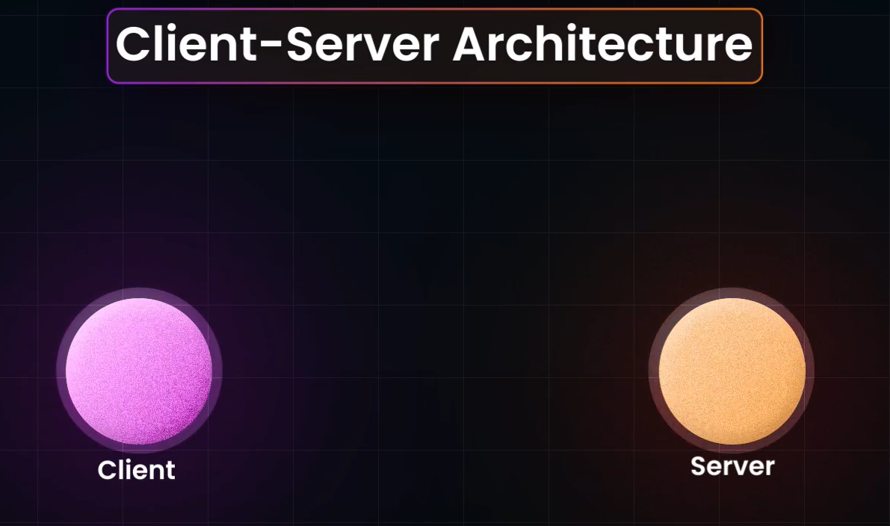

# Client- Server Architecture

- Consists of 2 Entities - Client and Server
- Client- Requests for a service
- Server - Listens to the Client and Offers Service to clients

- For example if we type amazon.com in Browser
- Browser is the Client and amazon has its server , amazon has many servers
- When we type amazon.com in Browser, The Browser makes DNS Query, This goes to Predetermined Set of DNS Servers, asking what is Address of amazon.com, it queries back the IP address of amazon.com. IP addresses are Unique Identifier of machines. 
- For amazon.com, the IP address is Provided by AWS
- If we build server in GCP, Google Cloud will provide us an IP address.
- Now server Knows the IP address of amazon.com, Now the browser sends and HTTP request to the specific amazon server.
- When client Sends Request to server, it sends bunch of bytes of characters(called packets), in special formats, this request consists of IP address of the Browser 

- Any machine which runs a server has about 16000 ports.
- The request sent by teh Browser, is correctly directed to the Port number mentioned in the packets.Port number is mentioned in the packets.
- If IP addresses can be mapped to mail boxes in apartments, Then Port is the House number of each House
- There is Designated Port for Each Protocol
- If client gives a HTTP request, PORT nnumber is 80 
if HTTPS => PORT 8443