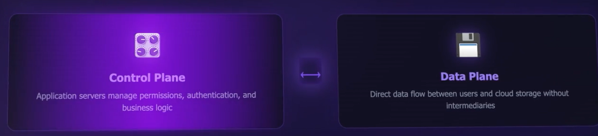
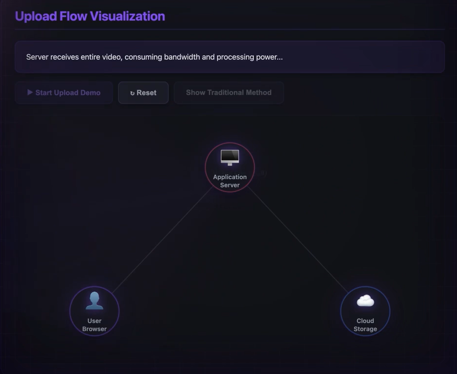
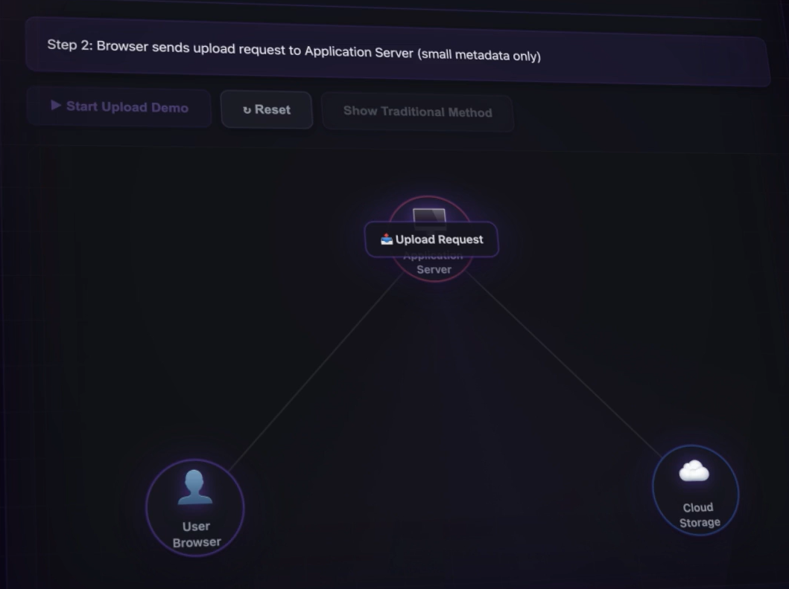
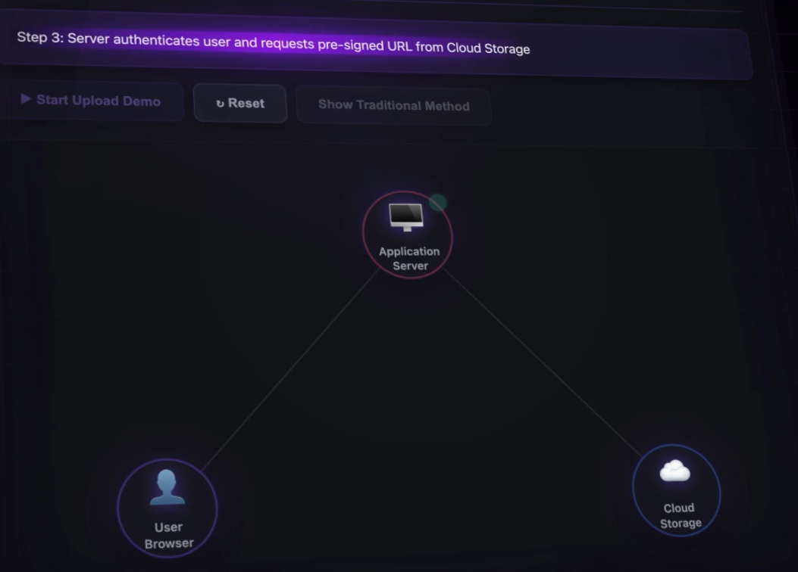
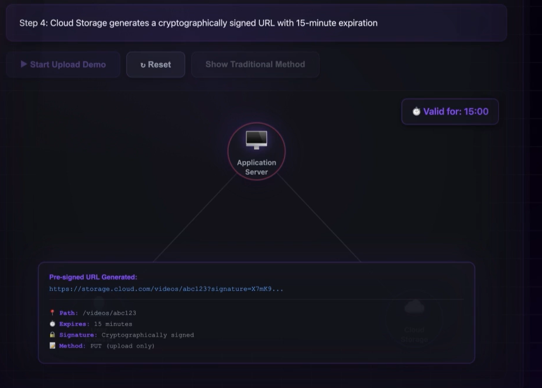
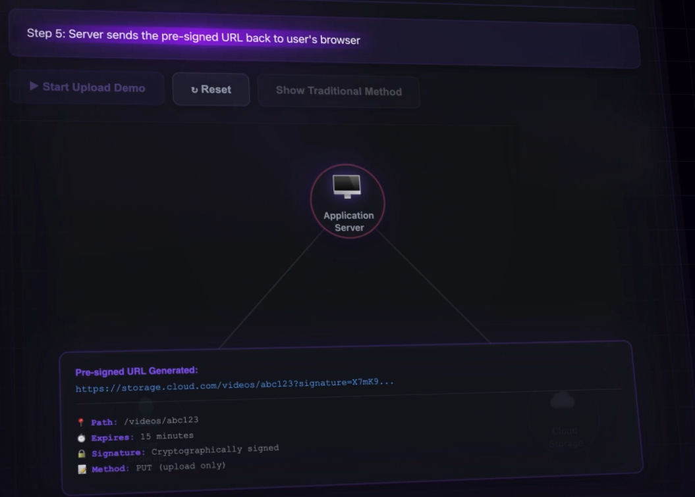
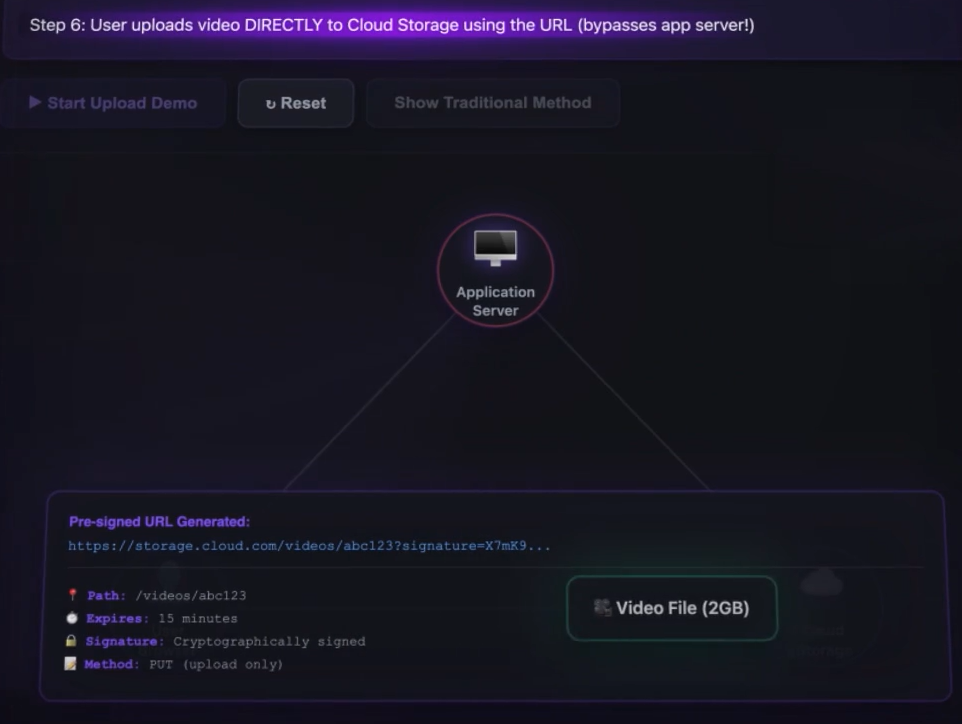
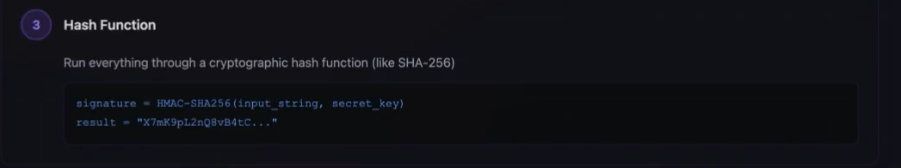
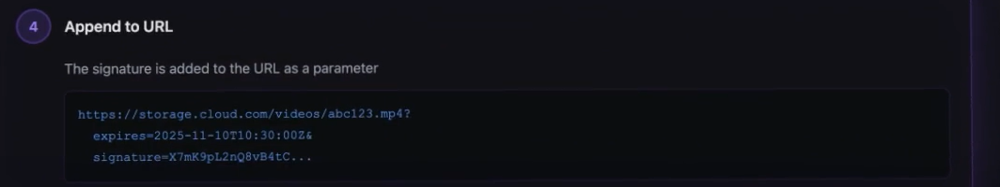
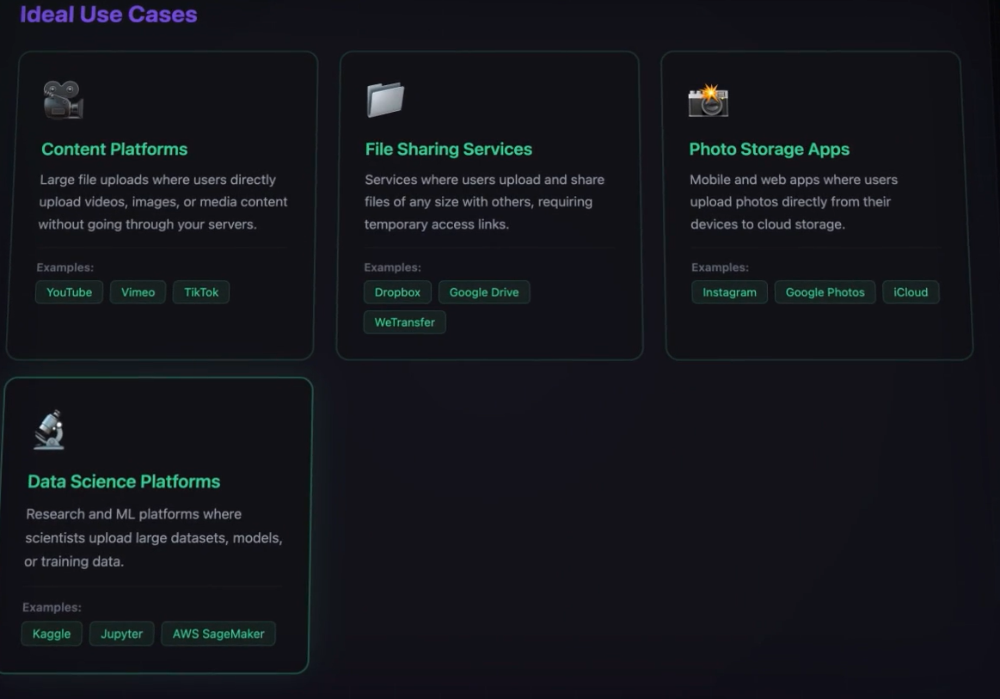

# Pre-Signed URL:
- It enables Direct communication between the Client and the Storage Providers(Cloud Storage) **Securely and Temporarily**.
- Keeps **Application Servers** Light weight and focus on Business logic instead of Focussing on Large Data Transfer that's happening. No more bottlenecks from Massive File Uploads.
- These are Fundamental Pattern in Modern Cloud Architecture.
- It seperates the Control Plane From Data plane. i.e Server Controls what happens and data directly flows into thr Cloud storage, without the Massive data going through the Application Servers. This enables companies like Youtbe to Scale to billions of uploads

- Consider this case, Millions of video uploads happens simultaneously in Youtube
- If all those Files had to flow through the application servers, then those servers would become a massive Bottleneck
- Pre-Signed URLs solve this problem.
### Normal way of uploading video:

- Uploaded video reaches server, the server Authenticates user, checks informations and forwards teh video to Cloud Storage.
- Now, the Server is handline many GIGA BYTES of data, as thousands of users are uploading Simultaneously the bandwidth of the server gets crushed
- And we are paying all the Data transfer twice, from CLient to server and server to DB.
- Therefore we need a way for users to Directly upload the Video to Cloud,**securely** without sharing credentials of the cloud and without Bottlenecking our servers. Here comes pre-signed urls 

# Pre-Signed URL:
- It is a Special URL, that GRANTS temporary PERMISSION  to upload or download a specific file, without **NEEDING ANY CREDENTIALS**.
- Then it automatically expires after a set time, which is generally few minutes.

## Characteristics odf PRe-Signed URL:
- Provides access to only Specific File.
- Valid for limitted amount of time.
- Cant access files other than specified file.
- No credential needed!
- **Automatically Expires.**

## The Flow:
- The Client sends **Upload Request** to the Server to Upload Video, without sending the video data

- The Server Authenticates the User, then it sends a request to create pre=Signed URL to The Cloud Service, the Cloud, in turn returns a pre-signed URL

- This PreSigned URL is created by hashing the values like storage area folder along witha Secret Key that's known only by them, so that, even if a person who is trying to access the other storage area by changing anyuthing in the PreSigned URL, it will be found out at the time of re-checking.
#### The INformations encoded in the URL:
- - Path of location where the file will be stored.
- - HTTP method that is allowed
- - Expiration Time Stamp
- - **Cryptographic Signature**

- This PreSigned URL is sent back to the User by the server(this is valid for few minutes liek 15 mins)

- Now the user can directly upload the video to teh Cloud, without server being an Intermediate. 

- When Cloud Storage Receives the Upload Request, it first Validates the URL by:
 - - Checks Signature of the URL
 - - Checks whether the URL has expired or not
 - - Is the HTTP method Correct.
- IF everyting is fine, it accepts the video and Stores it!
- The Cloud Acknowledges either the Server or the Client browser that video has been uploaded!

## How secure is this method is:
- general question: If anyone having the URL can upload whatever they want?
- Its not possible, as teh URL has Cryptographic Signature Encoded in it.
- We already know that the Cloud Generates the URL based on the file path, HTTP method,  expirationm time of the url adn other parameters like "content_type"
- All of these are hashed along with a secret key by a Cryptographic Hashing Function, this created a **signature**

- This Signature is Appended to the URL. 

- When the URL again comes from the CLient Side to Cloud, It takes all the PARAMETERS from the URL and applies the hash function along with secret key, this will generate a signature, Now check whether the newly generated Signature and the signature present in the URL is same or not, if yes then its a valid URL , else its not a valid URL.
- So if anyone tries to tamper witht the parameters in the URL, it will be identified easily.

## Impact of Pre-Signed URL:
- It divides the Control pane and Data Plane of the Architecure!
- The Application server Controls the Control plane, this involves Authentication, Authorization, URL generation
- The Huge actual data, directly moves from Client to Storage, this is data plane
- Seperation of Control and Data Plane has a great impact on Scalability, Cost Efficiency , Performance and Security

- Security: If an URL leaks somehow, it will be expired within a minute.

## Use cases:
- If users are Uploading Files Directly Pre-Signed URLs Are always teh right Choice!

- NOTE: CLient must be Able to make HTTP Request to the Storage Provider

## Edge Cases:

