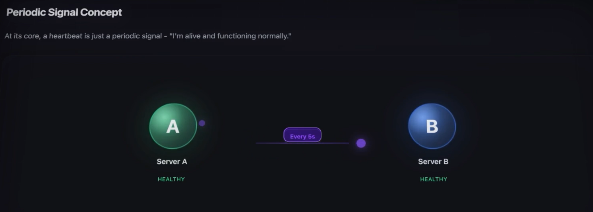
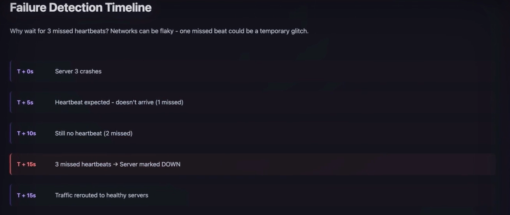
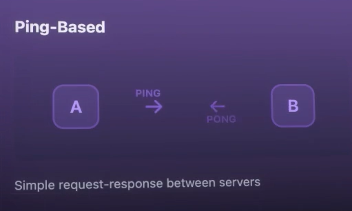
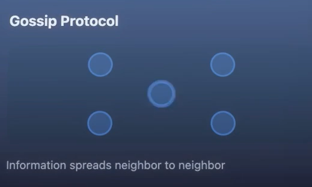
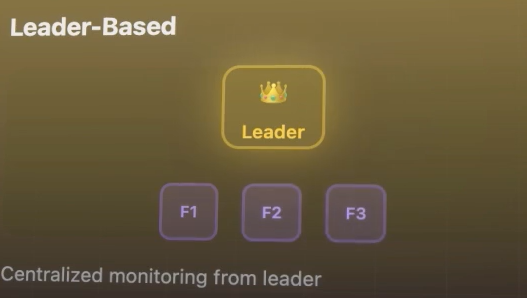

# Heartbeats / Health Check:
- Servers sends Heartbeats to show they are Alive. 
- basically its a "I am Alive Signal" sent by the servers in **Distributed Systems**.
- **Health check** will include more detailled Things like CPU usage, Memory available.
- Health Check and Heartbeats are same Core Concept.
- Heartbeat is basicaly periodic Signal between servers to inform "I am alive and  Functioning Normally"

- Lets assume Server A stopped Sending Heartbeats to Server B,

- Server B realises, it has not sent any heartbeat for 5 continuous Seconds, so assumes Server A has Failed

- Server B doesnt assume server has failed with one single miss of Heartbeat, **this is because Network can be Flaky**, maybe htere ws Time Delay or Packet got Lost.
- If it had multiple Heartbeat miss in a row, then server B assumes there is definitelhy problem with server A.
## Usage of HeartBeats:
- 1) **Routing Decisions**: Figuring out which server can handle the Requests
- 2) **Failure Detection**: Knowing when some server goes down, so that we can Redirect the Request to other servers.

## Implemented Approaches:
#### 1) **Push Based**: 
- It doesnt wait for anyone to ask, it just proactively broadcasts it Heartbeat to all the servers, This approach ahs trade off between Speed ot identifying and Network Overhead.
 - - this is appropriate for systems where you want to find Server Failure As quickly as Possible!
 - - **Downside**: High Overhead . For Large Systems    it creates a huge network traffic , all these Heartbeats can Congest the network
 #### 2) **Pull based(aka Polling)**: 
 - There is One single Central Monitor, that periodically checks all the server, asking "Are you alive", the servers Only Respond when the Monitoring server asks, but in this teh Failure Detection is Slower, it depends on How oftern teh Central monitor does its checks.
 - - Much more efficient in terms of Network Traffic.
 - - The Monitoring Server has a clear View of Entire System's health.

#### 3) **Heartbeats with Acknowledgement:**
 - - Server A sends HEartbeat to Server B, tehn Server B acknowledges that it has recieved it
 - - This ensures both the server is Alive
 - - This also ensures the Signal has been Received by server B from Server A, without and Network Problems.
 - - Disadvantage: It Doubles the Network Traffic , as for one single heartbeat, 2 signals needs to be sent across the Network.
#### 4) **Heartbeats with Quorum:**
 - Used in Highly Distributed Systems.
 - Server is not alive untill Majority of the other Server Confrims. 
 - This is very smart, as it AVOIDS FALSE POSITIVES!
 - This approach Creates A significant Amount of Network Overhead, as every server is talking to every other server

## How Often does the Server Needs to Send Heartbeats?
- If heartbeats are sent very frequently 1-2 seconds, Results in HIGH Network Congestion and Quickly can be Identified if Failure in any server. All these traffic can slow down the Actual Customewr Request we are trying to Serve
- If we send Heartbeat every MINUTE to reduce overhead, then the Detection that a server failed will take 3 whole minutes! Which is not welcome, it definitely reduces the Network Congestion.
- The Sweet Spot depends on the System we are trying to build, For most Web Apss is 10-15 seconds and threshold of 3 missed haertbeats , this results in finding any Failed Server at at most 15 seconds.
- high traffic application mostly choose 3-5 seconds as the Interval as every second of Downtime Costs money for them
- backgrounf Processing systems that are not customer facing wil take 15-2 seconds
- KEY IS MONITORING THE SYSTEM AND ADOPTING ACTUALLY WHAT WORKS!

## Different Patterns of HeartBeats:
#### Ping Based Heartbeats:

- Servers ping each other to inform that they are alive!
- Straightforward and LIGHTWEIGHT
#### Gossip Protocol:

- It works as how Gossip works in Social Network
- Instead of everyone to everyone, Server tells that they are alive only to tehir NEIGHBOURS, this message i passed to their other neighbours, this way the message spreads.

#### Leader based HEartbeats and Systems:

- One Designated Leader Collects Heartbeat from each server
- This leader has Centralized Vuew of all the Servers
- The Leader sends heartbeats to otehr server to prove that its alive
- If the leader fails, the Other Servers chose another leader

## Tips on System desing:
- If you geet question on this topic make sure to think about Time out and thresholds