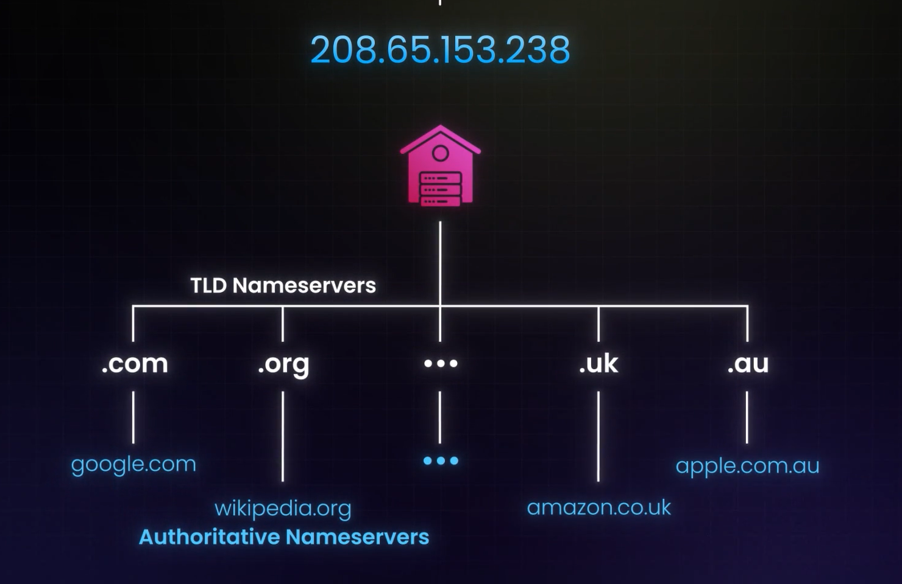
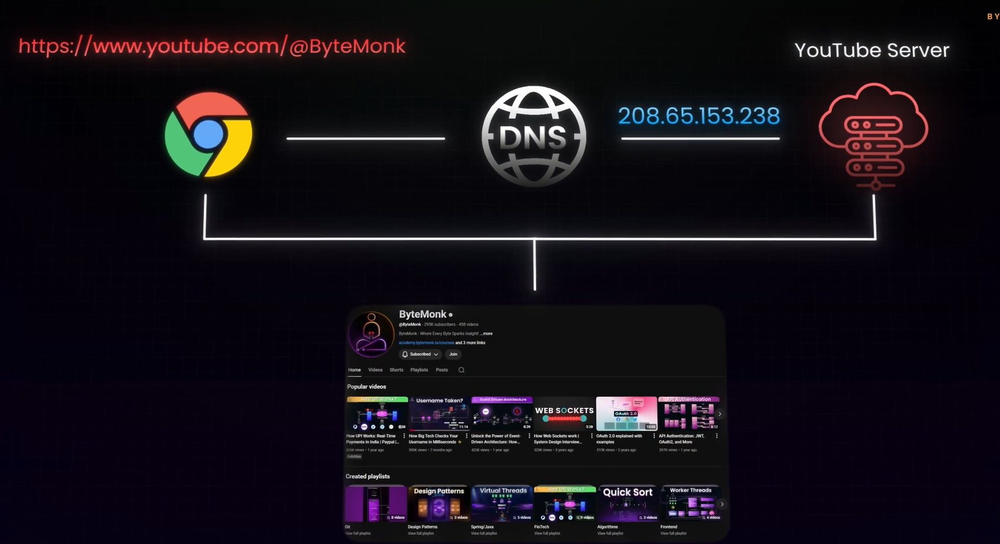
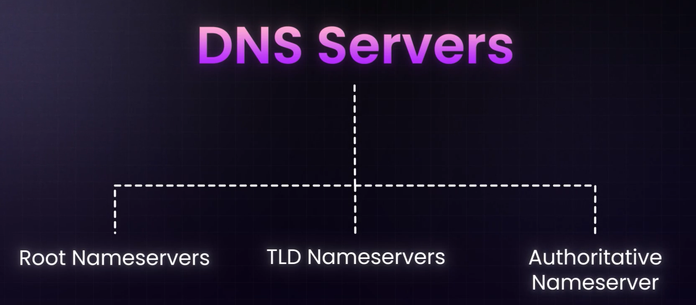

# Domain Name System:
- Converts HUman Readabmle domain name into IP adddress
- THere are various types of DNS Servers within the DNS heirarchy! example: .com , .org, .uk , .au
, Each servinf a unique function.
- Whenever you type teh correct website URL,  the Nameserver gives the cirrect IP address to the  Browser, then teh browser sends HTTP request ot he target server

- Main  functionality of th eDNS is because of hte Hge Databse it holds!, which convewrts DNS names to IP addresses
- Everyone who uses internet uses the DNS server, therefore the load keeps on INcreadses!, this server are maintained by VERISIGN and verifies the Databse of all Registered Domain Names
- DNS is  a distributred set / cluster of Servers Spread across the whole world!

## THe Flow:
- When we tyupe some website to sarch, the website goes as query into teh DNS Resolver!
- Tihs DNS Resolves is derivided by either the INternet Service Provider, Cloudfare or Google

## TYpes of DNS Server:

- Name server is a Specific type of server wich performs specific Jobn, Converting Names into IP addresses
 ### There are toallty 13 Room Name  Services GLoballly:
 - They fomr teh Fondation of DNS HEirarchy.
 - anytime we does a DNS query, we et routed ot one of the Service.
 - Nameservers store the IP addreses of TLD name servers, TLD nameservers store the
 
 ## Authoritative namesewrvers:
 - These are final truth to the DNS recordds.
 - They store more accurate records of the DNS and Domain Names

 ## Detailled Workflow:
 - Types a qwebsite name
 - Browser checks if the IP address is alrdy stored as Cache
 - Of not found then checks teh OS, Routet and ISP
 - If   ISP DNS servers doesnt have teh Result, then they query teh ROOT DNS servers
 - Root level DNS directs the response to Top LEvel Domainm Serverds!
 - for examp,e TLD is responsible for .com, .org etc.
 - Aithoritative Servers are Primary source of triut fo all domains, they return the IP address of the requested DOmain
 
 - Finally teh YT recieves the Hit the server, now you will get episodes without ads.