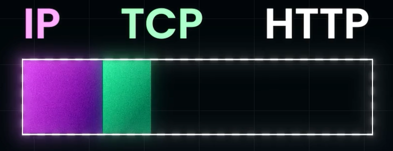
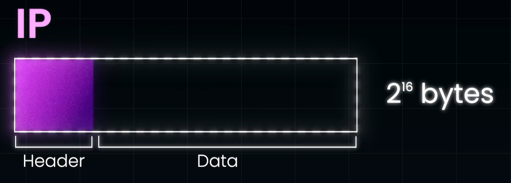
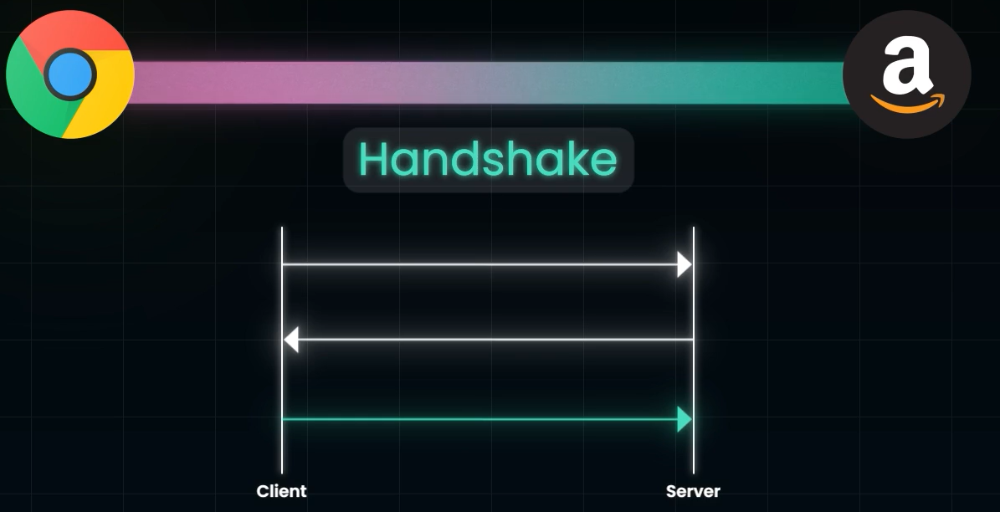
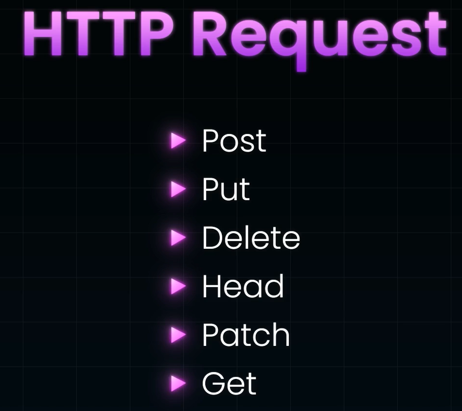

 # Networking protocol
 - Its a set of for Formatting and processing Data.
### - Three major Protocols:
 
## IP Protocol:
- Machine sends data to another machine, it send as IP packet.
- IP packet is fundamental unit of Data store in Bytes.

- IP packet consists of Header and Data part.
- Header consists informations of:
- 1) Source address
- 2) Destination IP Address
- 3) Packet Size
- 4) Version of IP, either IPV4 or IPV6
- Data is the Information that is sent between the machines
- Size of each IP packet is about 0.065 Mb
- While sending images, it is sent as multiple packets, thereforre, the ORDER in which these packets are sent matters, so that the receiver gets data in correct structure without any loss of inofrmation

## TCP protocol:
- Built on top of IP protocol.
- It guarantees that all IP packets are sent in Correct order
- Ensures all package being transmitted is recieved by the Receiver without any damage
- TCP is used in almost all Web Applicationsas it allows us to send all pieces of data, which IP cant do on its own.
- Each IP packet will have TCP header in its DATA section
- When a client wants to send a request to the server, it first establishes a TCP connection, by making a Handshake.

### Disadvantage:
- It lacks easy to use framework for Developers to define meaningful communication channel, as in TCP we are just sending Arbitrary data.

## HTTP:
- It creates a Higher Level abstraction on TCP.
- Devs write code to interact with HTTP protocol and not TCP protocol.
- this abstraction is a request-response paradigm

#### Types of HTTP Requests:

### Difference between REST and HTTP:
- **REST** : Its an architectural Style for Distributed Systems
- **HTTP** : Its a network protocol, that is its a set of rules for Formatting and Procesing Data.