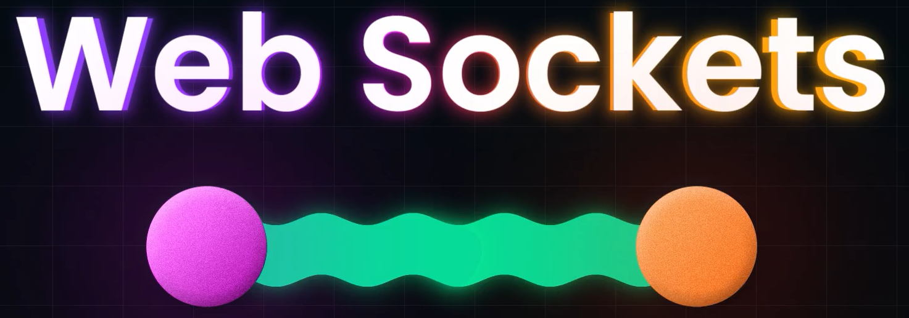
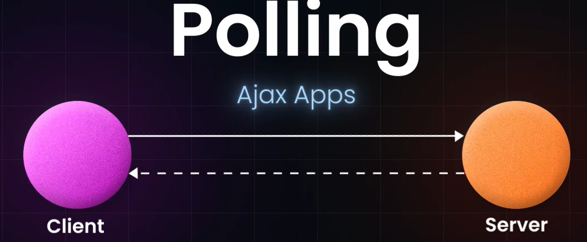
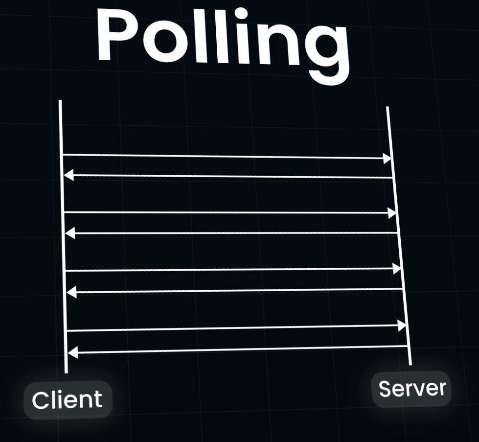
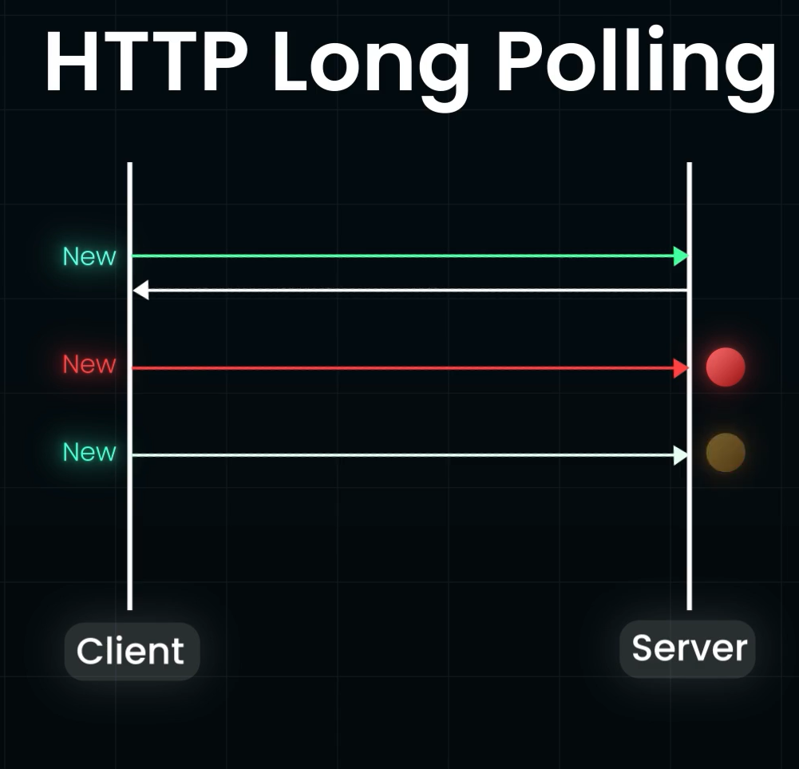

# Websocket Protocol:

- Protocol Developed for Bidirectional Client-Server Communication
- Capable of Sending and Receiving data **simulataneously** in a TCP connection. 
- In HTTP the Server will just **respond** to the **requests** made by the client, it cant send information on its own will.

- Polling is widely used concept, which is widely used in Ajax Apps, where the CLient Repeatedly makes HTTP request to server for data
- Client will make periodical REQUEST (for data) to the server.
- If the Server has no data for the Request, it replies with Empty **response** 

- The problem in Polling is the client needs to keep asking the Server if any data is available, which results in creation of lot of new responses and many **empty responses**, whch creates a lot of **HTTP OVERHEAD**
- This is solved by Long Polling
## Long Polling: 

- Client first makes Initial HTTP REQUEST and WAITS for a response.
- If the server has data for the REQUEST, it immediately sends the response
- If not, the Server delays the Response, waits till it has Data for the Request.
- When it Gets the Data for the Request or when a TIME OUT has occured, it sends back the Response
- This is called Hangin GET.
- Then the client again sends a HTTP request, IMMEDIATELY or upon a WAITING PERIOD
- Each Long Polling HTTP Request has a TIME OUT, when the Time out Ends, the client should send another HTTP Request to the server, once it recieves the response from the server, teh ```CONNECTION IS CLOSED```
- Its very Resource Intensive.

## Web Sockets:
- It's a full Duplex Asynchronous Messaging, so that both server and client can stream messages to each other Independently.
- It's used to send and Recieve Information Simultaneous using TCP connection
### WebSocket connection is Initialized n 3 stages:


### Application
- Real time Web Applications

### Web Sockets can eb Overkill if:
- The data fetch is happening ONce
