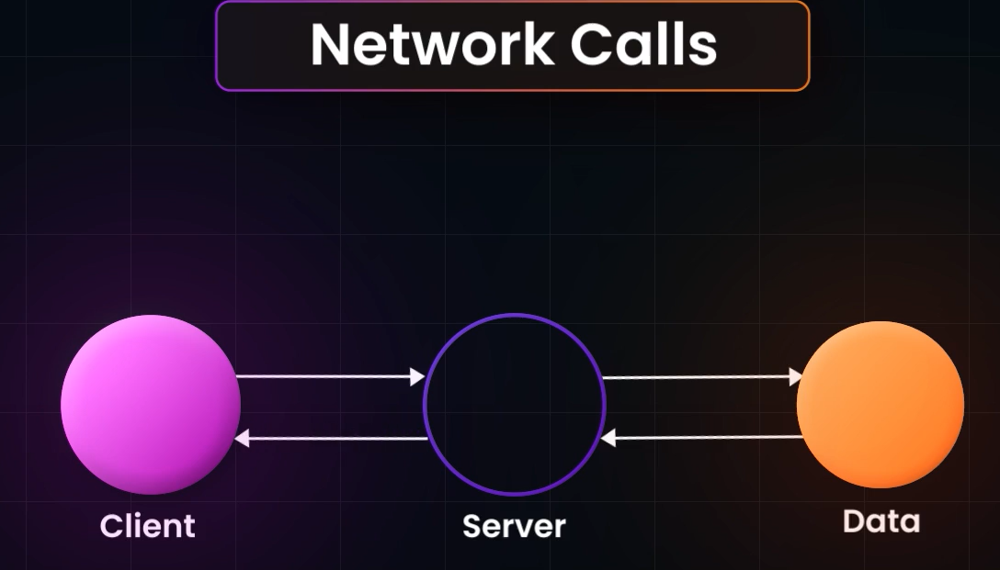
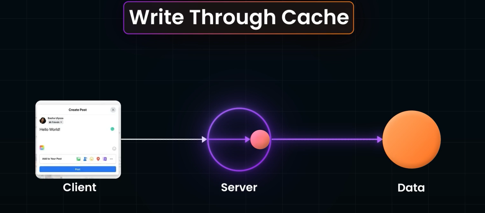
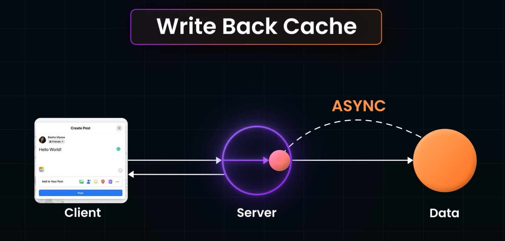

# Caching:
- It is Storing of Data in Different location from the Source, so that data can be Accessed Faster.
## Different Levels of Caching:
- Client Level Caching
- Server Level Caching: Server just acquires data from DB once, then uses the Cached Data for forcoming purposes
- Instead of Having Cache at server level, we can have cache at level between Server and DB

## USe Cases of Caching:
- When we are Expecting many **NETWORK CALLS**

- By Caching the RESULT of the NETWORK Operation, we can Speed up Operation
- So, if CLient Caching is Implemented, there is no need to make Calls to Server and Server makin g call to DB and vice versa
---
- When Doing **COMPUTATIONALLY EXPENSIVE OPEATION**

- its not the Network request we are trying to Avoid, but the Time wasted in Doing the Same Computationally Intensive Operation again and again,
- Caching avoids time waste through Server Computing for the Request, maybe the server is performing A complex Algo with poor TIme COmplexity
- Caching the results will Speed up in Executing the Operation by the CLient.


## Types of Caching:
```Write Through Caching:```

- For example Consider a social media Platform like Instagram, some one Posts a post, while posting the post, teh POST req hits the Server, the Server Writes the Data in its Cache as Well as Updates to the DB by making a call to the DB. 
- This method doesnt reduce the Network calls that is being made.

```Write back Caching:```

- In this Type of Caching, teh Writes are only made to Server Cache everytime a POST Request comes from the CLient Side, and immediately sends the Response back to Client without Sending Writing Call to DB.
- It's written into the DB Asynchronousl, either Radonlhy or Schedule basis.
- This reduces the Network Calls.
- This will get Trickier when it comes ot Large Scale Applications
