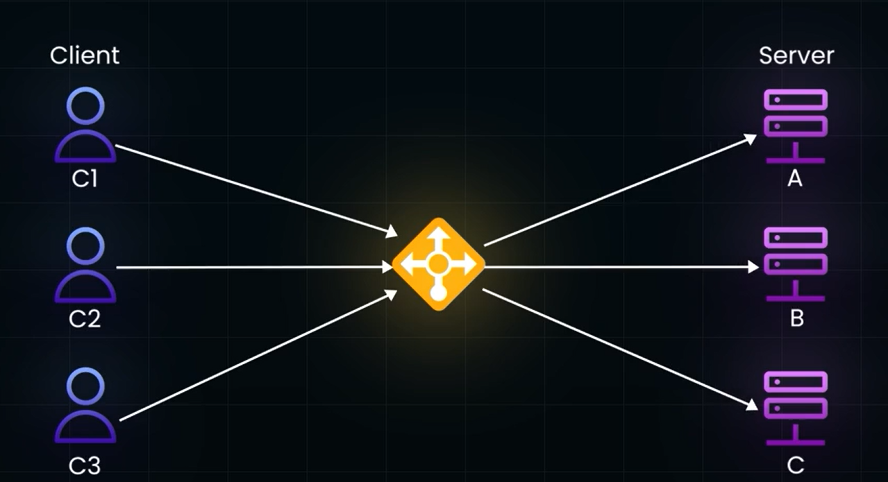

# Hashing:
- Involves Converting Arbitrary data into Fixed Size Value.
- The data can be anytihng!
- Consider Load BAlancer as an Example

- INstead of Mapping  Each Client to Serveer Directly, we will have a Load Balancer in BEtween them, so that Client Requests will be Routed and it will be Evenly Distributed to the Servers.

- To route teh Request to Particular Server , it needs a Server Selectiin Statergy, i.e which Request should be Served By WHich Server
- Methods to Select Server:
  - - Random Method: Assigning to any available Server Randomly
  - - Round Robin Method
- One of the method is Chosen based on Traffic.
- If there are Computational Intensive Task, the Server implements Server Caching and just Respondse with the Alrdy Computed and Stored Response to the Load BAlancer. 
- If Round Robin or Random Selection of servers method is used, It will lead to Lots of Cache Misses which in turn leads to UNnecessary Computations
- **Cache Miss** : Cache made by Server, not utilised by Load Balancer.
- For example, if C1 Sends req to Load balancer, the Load balancer in turn Redirects to Server 1, teh Serve 1 computes the Result and stores it and sends back the result
- IF again the C1 seds req to load balancer, due to Random Assigning method or Round Robin Method, the request may get redirected to Server other than Server1, here Server Doesnt have the Cache, so Again unnnecssarily needs to compute the Whole result, but the result is alrdy ready to give as response in Cache of Server 1, this is called **Cache Miss**.

- Therefore, we need a better Server Selection Statergy, we can use Hashing in this.
- We can HASH each of the CLIENT REQUEST coming to the load balancer.
- Based on the HASH value we can Route to the Request according to the Postion of the Server.
- hashing functions Used: SHA-1, MD-5, BCrypt, these types of hashign Functions evenly distrbute teh clients among the server, instead of redirecting most of teh clients to one single server leading to **SERVER HOTSPOT**.