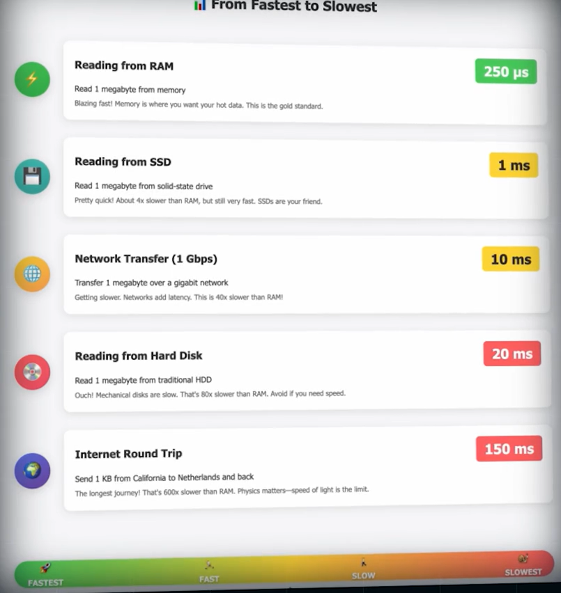
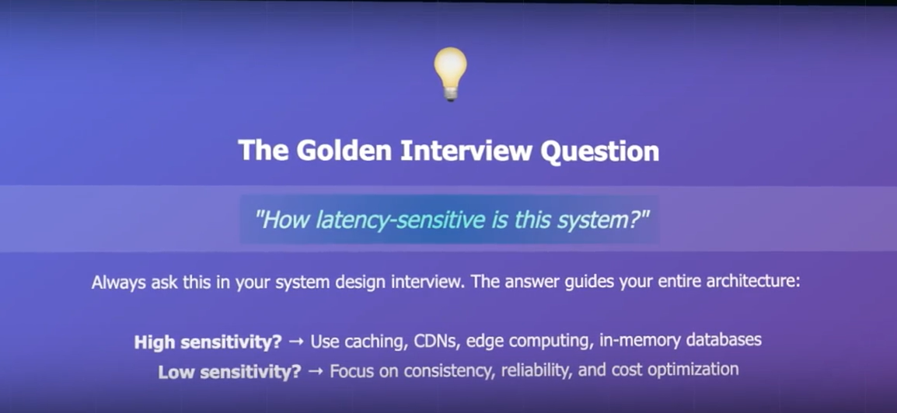
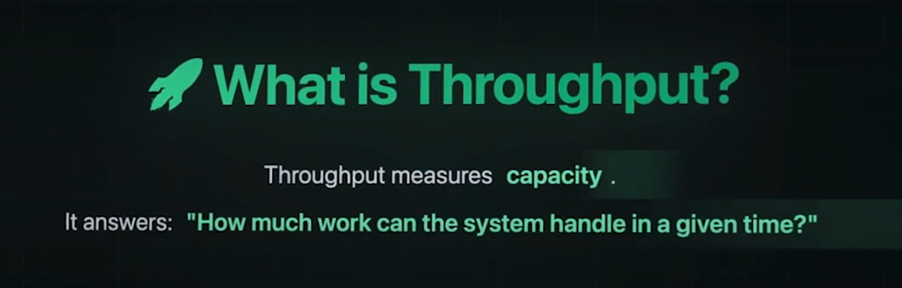
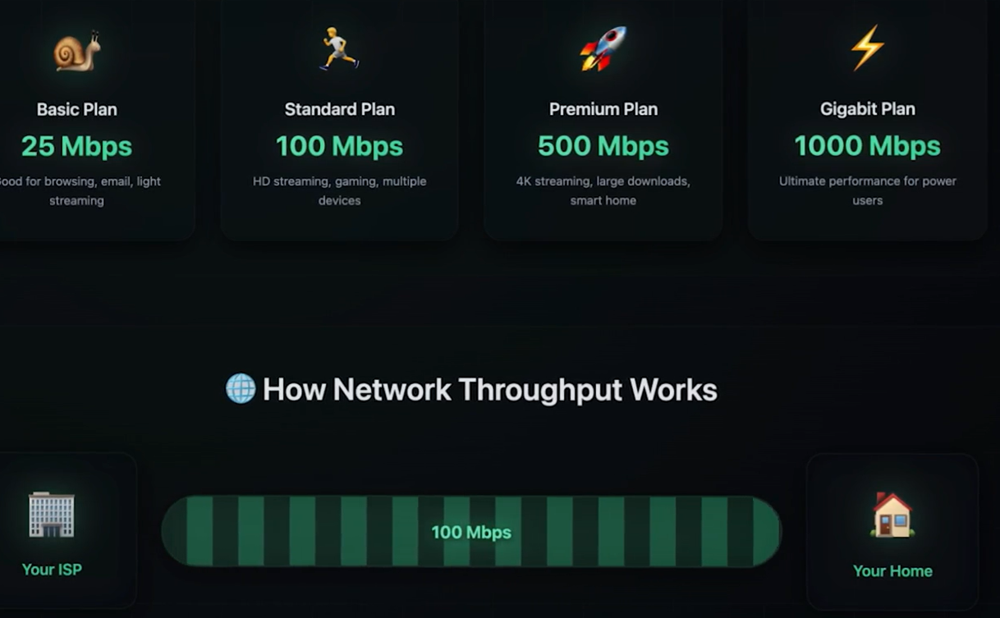
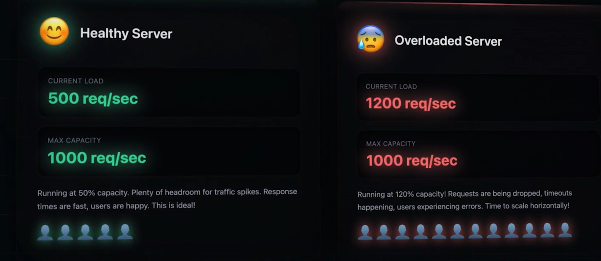
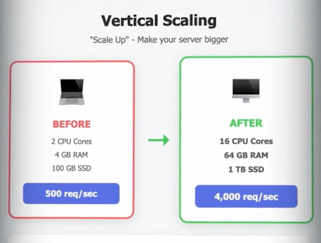
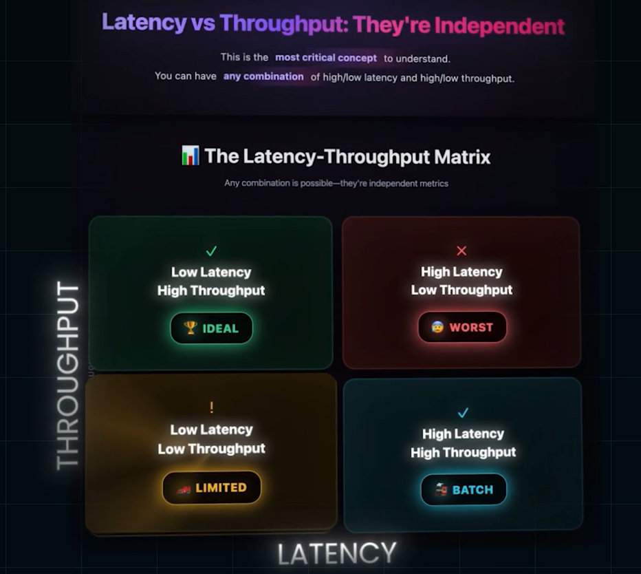
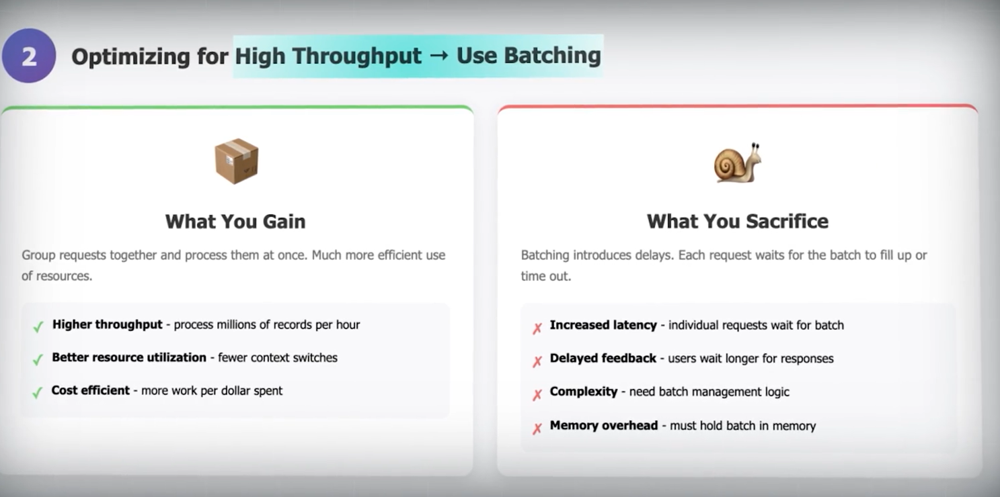
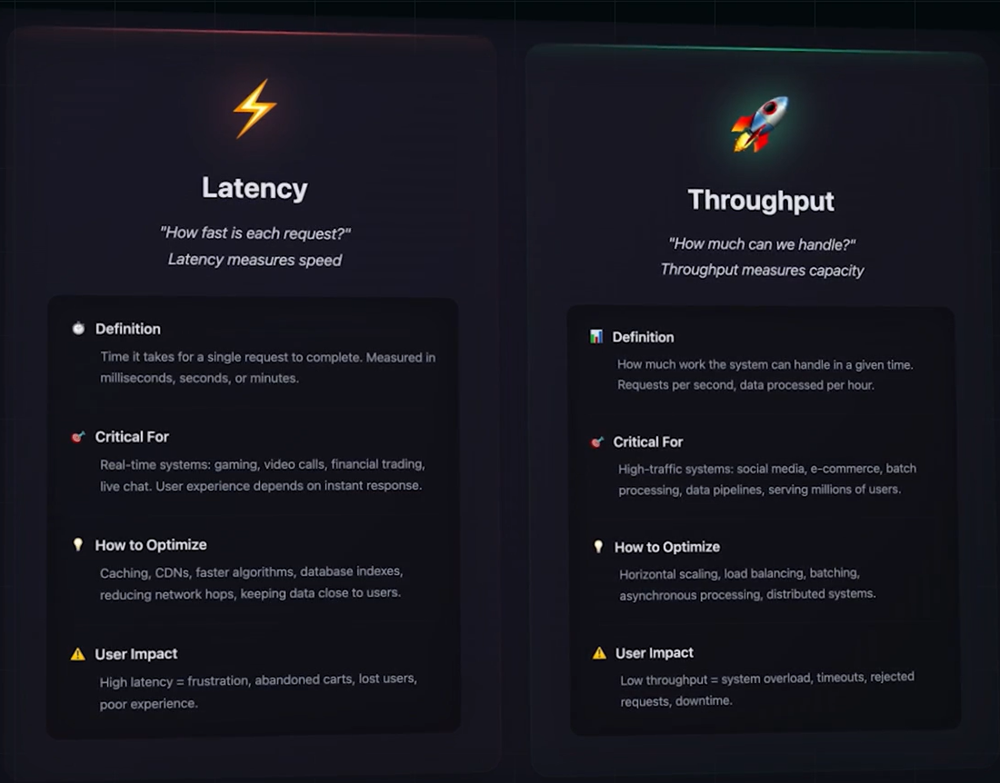

# High latency Low Throughput(Important Concept in Terms of Interview):
- While playing Online Games , The LAG we experience is due to HIGH LATENCY AND LOW THROUGHPUT.
- LATENCY AND THROUGHPUT is the MOST IMPORTANT PERFORMANCE MEASURES IN A SOFTWARRE SYSTEM.
## Latency:
- its a measure of delay, asnwers the question of How long does data take to move from one point to another in a system.
- **NETWORK LATENCY**: its the time taken by the data to move from Client to Server and then From Server to CLient.
- **Disk latency and memory latency**: Time taken to read or write data in RAM, SSD or Drive

- **NOTE: IF YOU NEED TO REDUCE THE LATENCY, KEEP THE CLIENT AS CLOSE TO THE DATASOURCE**

## Latency in System Design:
### Latency-Sensitive(every ms counts):
- Online Video Game: IT NEEDS TO BE LESS THAN 50ms, if its about 100ms, it wont be playable.
- Video Calls: SHOULD BE LESS THAN 150ms
- High Frequency Trading: CANT TOLERATE EVEN A FEW EXTRA MILLISECONDS. IT CAN COST MILLIONS OF DOLLARS

### Accuracy Tolerant:
- Airline Booking: Its okay even if Transaction happens after a delay of 1-2 seconds, as long as it doesnt cause any problem in booking like boooking 2 seats inastead of on. Consistency Matters over Speed.
- banking Systems: Cares Correctness and Accuracy more than Speed.

## Tips while doing Interviews:

# Throughput:
- Measures Capacity- how much work can teh system or server handle within a given Amount of Time. High Throughput is ESSENTIAL for Systems Serving Many users Serving High Data volumes

- In networking Throughput is mostly measured in MegaBitsPerSecond or GigaBits Per second. (Mbps/ Gbps). This means, they can transfer, this much amount of data per second

- In **WEB SERVERS** Throughput is measured in **Requests per Second**, for example, if server can handle 1000 Reqs/Secondn thats the Throughput of the Server.

- If the Server Throughput is 1000 reqs/s but the numnber of reqs hitting the server is 1200 per second causes **SERVER OVERLOAD**, this results in:
 - - Queing Up of Request
 - - Response Time Slows Down
 - -  These two results in Drop of Throughput.
- STEPS TO HANDLE SERVER OVERLOAD:
 - - Vertical Scaling: Upgrading teh exising servers, examples:
    - 
    - - 1) Increasing number of CPU
    - - 2) Increasing the RAM Capacity
    - - 3) Adapting Faster Disks
    -  Downside of vertical scalking is: There is a limit, we cant keep on vertical scalng forever.
 - - Horizontal Scaling (Most preferred Approach): Adding More servers to teh System, instead of Single Powerful server, we distribute the load across multiple servers, 
 - - This results in handling more requests Simultaneously with more macihnes working in Parallel. This is the better method.

## Latency VS Throughput:
- They are Independent of Each other
- Systems can have Low Latency with low throughput or High latency with High Throughput

- every System has Trade Off, we cant Optimize both Latency and Throughput

## Optimizing for Latency:

- To have low latency,we can have Implement Caching, but we should be Careful at determining the Size of Cache as it will affect the throughput, bigger the size, lower the Throughput.

## Optimizing for Throughput:

- If we want High throughput, BATCH Requests together and process them at once!
- But Batching Introduces Delays, resulting in High latency

##### So interviews discuss carefully about these trade offs, there is no One Size fits for all solutions, it depends on the  question.

## Summary:
