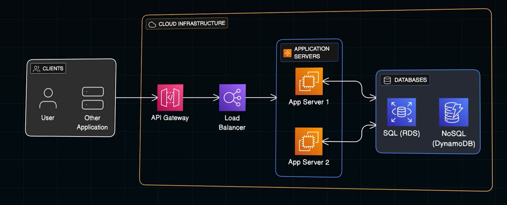
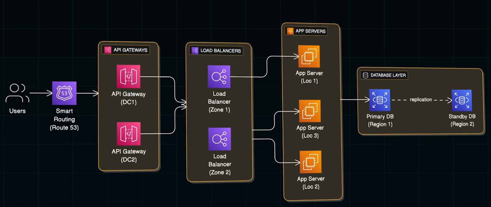
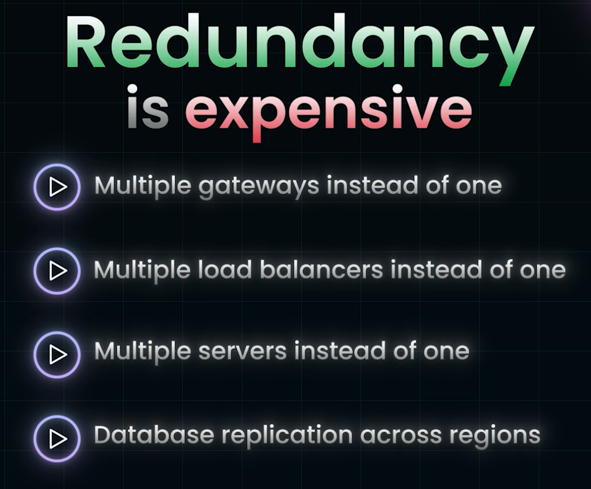

# Single Point Of Failure(Important Concept, simple to Understand, Critical to master):
- It's any component, which can bring down the ENTIRE System when it FAILS
- Examples:  server crash, Database Failure.
- Goal in System Design is to Identify those Single Point of Failures and Elimate it before its too late.    
- **NOTE**: DataBase is the Most important SPOF in any System.
- **Ask yourself before designing the System** : If This Component Fails, Does everything Fail?, if the answer is no, you have found you SPOF.
- Lets consider a basic Cloud Architecture:

### Function of API Gateway:
- Every Request first hits APi gateway.
- it Checks from whom the request came
- Figures out where teh request should go
- Then sends it to the right place
- If this is a Single Point of Failure, then at times of Failure, no person can use the Cloud
### Load Balancer:
- If there ios only One Load Balancer, and if it fails, the request made by the people would not reach the Servers, becooming SPOF.
### Servers
- In this Case, all the servers is present in One single Availability Zone, if the Entire Zone goes down due to power outage, network failure, Datacenter Issue, both servers goes offline together, becoming SPOF.

### Database:
- Most import SPOF in any system.
-   in case of Disk Failure, Netowkr Hiccup, CPU overload, it costs a huge amount to the company

### Datacenter Location or Availability Zone:
- If all the Resources are kept in one single Availability zone, The system is still vulnerable to localize outages

## Key thing to keep in mind while designing System:
- Never let system  depend  on any SINGLE component that can fail!.

## Improved Architecture:

- Ever resource is SPREAD ACROSS multiple Locations.
- This Principle is called **Redundancy**. Even though it costs more, only this makes the Critical Systems running without any complete breakdown.
- **Smart Routing (Route 53)** : Its AWS's DNS Server. 
 - - This Route S3 not only Converts URI's to IP addresses , it continuously monitors the health of INfrastructure.
- **API GATEWAY**:
 - - For example if one of the API GATEWAY is down, it redirects all the Traffic to teh other one.
 - - Instead of one single gateway we have MULTIPLE gateways across   different data centers! Its like having MULTIPLE Entries into a store, if one way ius blocked, customers can enter through other remianig ways.
 
- **LOAD BALANCERS**:
 - - Now we have Load balancers in different ZONES. same goes with Servers
 - - Each Load Balancer is present in Different **DATA CENTERS**
- **DB**
 - - There is StabdBY db (Replication of Main DB) in another Region, removing SPOF. They are not just different Data Centers,. they are different GEOGRAPHIC REGIONS.

# REDUNDANCY:

- We need to pay for all the Computation Cost, Storage Cost, etc as we have Redundancy.
- For a small project or Non  critcal app this is definitely an OverKill.
- For systems like: banking system, E Commerce Websites where Downtime means loss of revenueor danger to users, choosing the concept of Redundancy is the best
- Answer this question before adding redundancy: How much does the downtime cost the busines or authority.
- If downtime costs Customer Trust and loss of Revenue in Millions, then opt Redundancy
- if its just a simple Personal Blog, then dont use Redundancy.
## Other causes of SPOF: 

