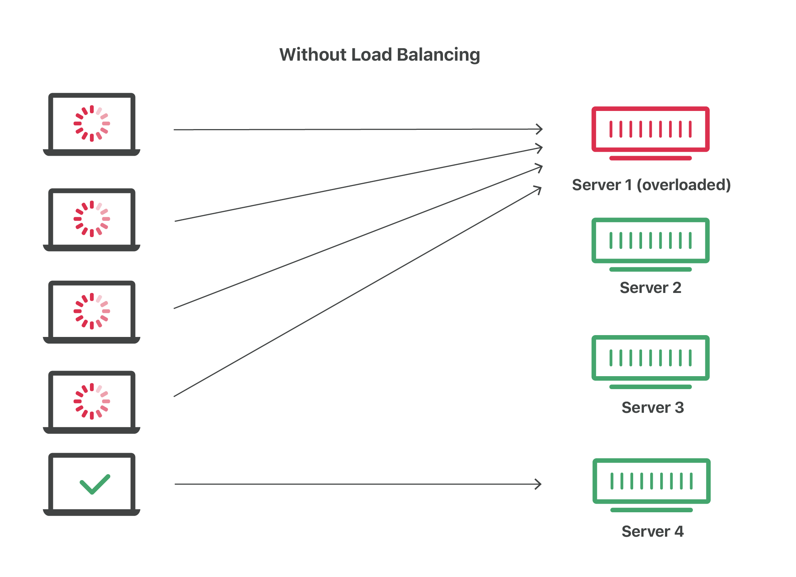
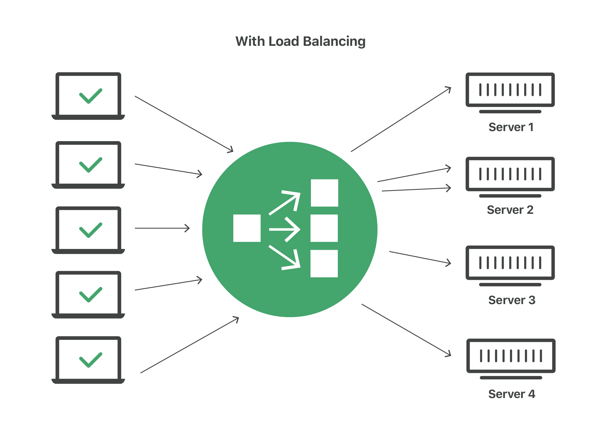

# Load balncing:
- Load balancing is the practice of distributing computational workloads between two or more computers.
- On the Internet, load balancing is often employed to divide network traffic among several servers.
- This reduces the strain on each server and makes the servers more efficient, speeding up performance and reducing latency

## GSLB:
- Global Server Load Balancing.
- This is done to redirect traffic across Servers in Different places of the World.

## Types of Load Balancing:
- 1) Static Load balancing 
- 2) Dynamic Load Balancing

## Static Load Balancing:
- It involves assigning servers to the Request in pre determined way
- It's already decided to which server teh request is going to be redirected.
- It doesnt take The Server Health, the Server Performance(i.e throughput), into considerations.
- Example: Round Robin, Weighted Rounf Robin and IP HASH.

## Dynamic Load balancing:
- It determines the routing of the request dynamically at the time of Receiving requests based on Health of servers, Performance of servers, How busy a server is, how much idle a server is.
- It monitors the health of the server periodically.
- If a server's throughput is less it redirects Less traffic towards it.
- **failover**: If a server is dead or Failed, it redirects all the Traffic to the server to other backup servers, this process is called **failover**.
### Examples:
- **RESOURCE BASED**: The load balancer assigns Servers based on current resource availability of teh server. Specialized agents run on each server to measure CPU and memory availability of servers. First the Load balancer Queries each agent before distributing thetraffic to he server.
- **LEAST CONNECTION**: Checks which servers have the fewest connections open at the time and sends traffic to those servers. This assumes all connections require roughly equal processing power.
- **WEIGHTED LEAST CONNECTION**: Requires a admin who gives weightage to each Server based on how many connections each server can handle.