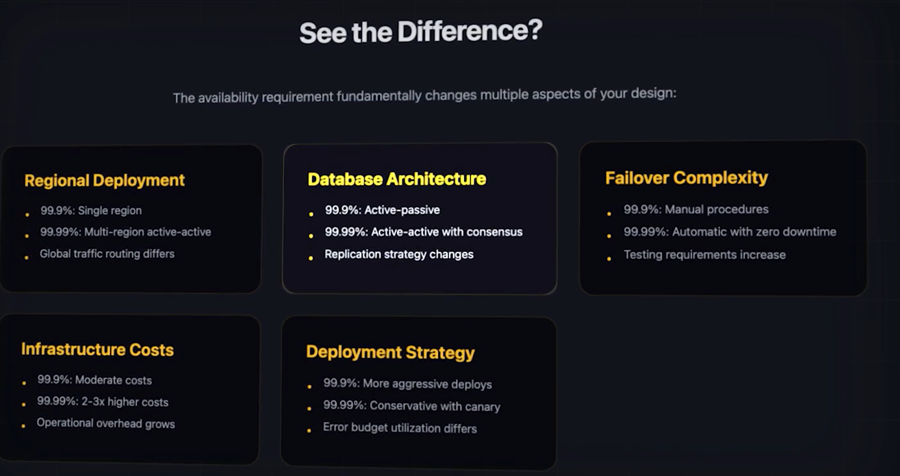

# Design System for Instagram with Availability 99.99%:
#### Instagram is used by Billions of People, having a 99.99% availability is essential, which gives the company 4 mins per month of downtime approx 48 mins per year.
- So, the system needs:
- Multi-Region Deployment for **Geographic Redundancy**.
- Load Balancers across Multiple Availability Zones with Health Checks.
- DB replication with Automatic Failover and Synchronous DB replication so that zero loss of data.
- Content Delivery network (CDN) for serving Images, with multiple Edge Locations Globallly!
- **Circit breakers** to isolate Failures and prevent cascading issues.
- No SPOF anywhere in the architecture.
- Rate Limitting to prevent any abuse to take down the system.

# Design system for URL Shortener:
#### Assignign 99.99% Availability to URK Shortener is Overkill, as i dun think ther will be that much traffic as in Social Media Apps
#### Lets fix with 99.9% availability , which gives us 43 mins of downtime per month we can optimize simplicity and cost.
- Active- passive Database Set up
- Asynchronous Data Replication is Acceptable!
- NO need to multi-region deployment, Single Region with Multiple Availability zones.
- Simpler Failover Mechanism, like manual Failover
- Lower Infrastructure Costs
- Basic Health Checks and monitoring
- Aggressive Error budget for rapid Feature Deployment.

# Differences:

