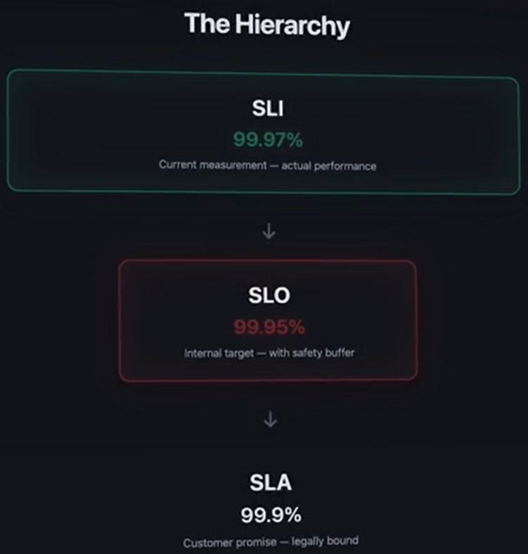

# Availability:
- Availability id the percentage of time that our system is Operational and Available to the USer.
- Expressed as 'uptime-99%', uptime 99.99%
- We cant achieve 100% availabiulity, Achieving Higher Availanility makes the system more complex ands teh cost exponentiaklly raises
- Every System wiull have downtimes or breaks duw e to Network Partition, Hardware Break, Data centers go down.
- It's one of the Big 3 concepts.

## Three Pilllars of MEasuring Availability:
### Service Level Indicator:
- Its the actual measurement in terms of %.
- Example: Requestr rate: 99.5%, System Responds 99.9% of time

### Service Level Objective:
- This is the Target measurement or metric we are trying to achieve whle designing the System.
- Its internal Target, that is promise made to stakeholder
- this is "What are we Aiming for?"
- THese are stricter than SLA's
- Examples: miantain 99.95% availability, 99% of API requirements within 100ms.

### Serive Level Agreement(SLA):
- This is the promise metric / measurement made tot he customer, often with Financia Penalties.
- Its like "What are we legally commited to?"
- Example: "we guarantee 99.9% uptime or you get 10% credit", "If availability is lss than 99%, then custiomers get 25% refund", "API abvailabiltiy 99.95% or compensaion."
- These Contract based, if the cmpanies or devs break them, they need to do as per the Contract

## THe Heirarchy:- SLI must be Greater than SLO, and SLO must be greater then SLA.

## Error Budgets:
- If SLO of your company is 99.9%, then Error budget is 0.1%, which provides your company 43 minutes per month for downtime or deployment
