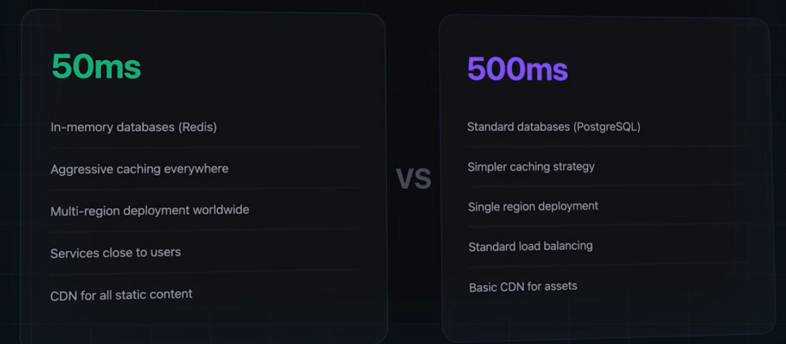

# Why latency Matters:
- It determines the Architecture of the Sytem we are going to build!
- Designing 50ms System vs 500ms System:

## Latency Requirements Decides these:

## Low Latency
- Low Latency is Expensive, as it involves more complex Infrastructure, more monitoring