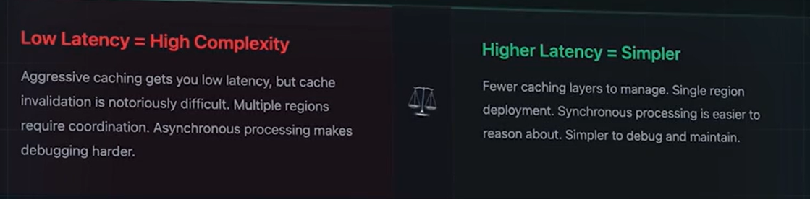
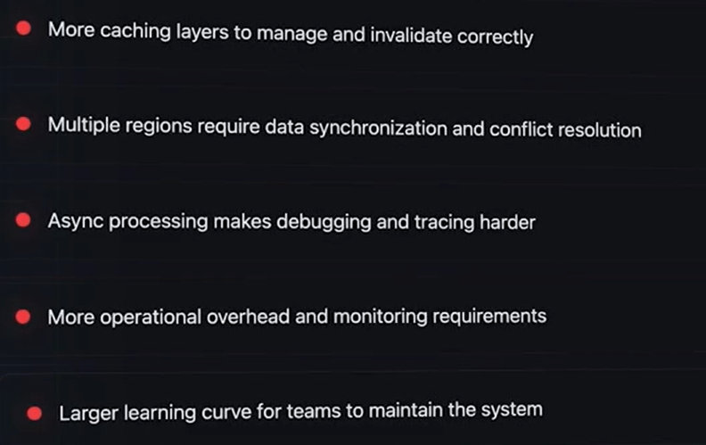

# Latency vs Cosistiency
## Lower latency:
- This results in Eventual Consistency
- This means the Redis Cache might have STALE Data.
- Users can get Fast Responses, but data might be stale or old, not updated
- this is fine with Social MEdia
- But not finw with Application whicvh requirees consistenmcy of data, even it requireds p99 of 200ms of latency instead of 50ms.

## Strong COnsistency:
- Requiredss coordination between servers, which in turn adds latency, Every server must ageee before responding, but data is always correct!

# Latency VS Cost:
- In memory storage costs 10 times than that of Disk
- Multi region cost 2 times
- Agressive caching costs 2 times that of normal caching and more complexity

# Note:

# Latency VS Complexity:

## NOTE:
