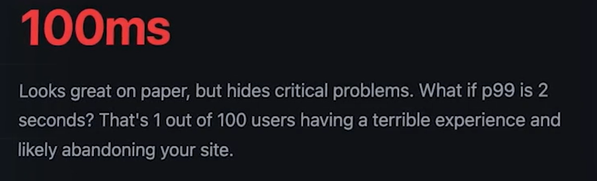
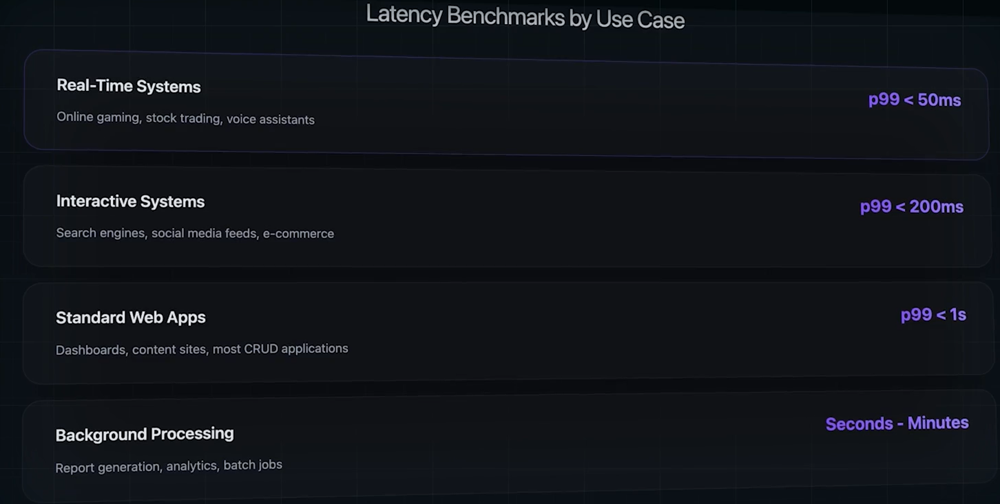
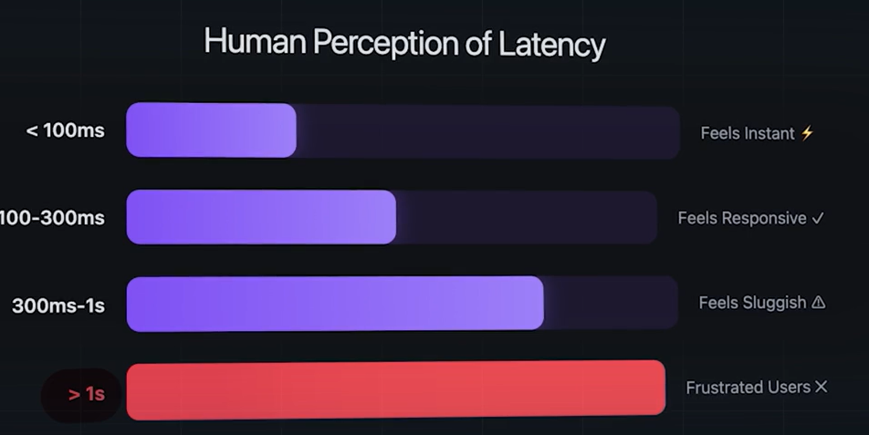

# Latency:
- Its the time the System Takes to Respond to the Request,usually measured in MilliSeconds.

# Percentile Latency:
## P50 Latency (Median):
- This means 50% of teh Request is faster the other 50 is slower
## P95 latency:
- 95% of the requests are faster than this
## P99 Latency:
- 99% of the Requests are faster than this

# Average Latency:
- Assume a System's Avg Latency is 100ms

#### Average LAtencies hides these problems, Percentile Latency shows these!

## Percentile Latency Benchmarks for Different Systems:

# Human pereption of Latency:

## Interview POV:
- Its always better to ask about the Latency Requirement, either P95 or P99