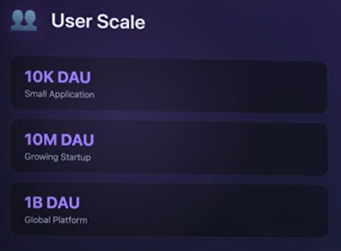
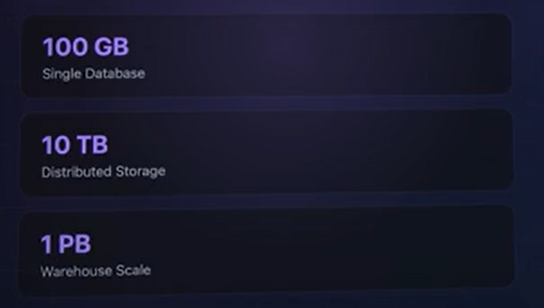

# Scale
- In System Design Intervies by FAANG Companies, in order to Design the System, we must Ask 
- - at what scale shd the system be designed?
- - How many users?
- - How manu Requests per Second? 
- This is imp because teh Architecture, DB, Chaching statergy changes for designing for 1000 users and 1M users.

## 4 dimensions of Scale:
### 1) user Scale:
- How many Users does the System needs to Support, in terms of Daily Active Users (DAU). 

### 2) Request Scale:
- how many Request Per second the System needs to Handle? 

- A social media app needs 10 thousnds reads per seconf 
- payment system might need 10,000 WRITES per seond
- The ratio of reads and writes also matters enormously!

### 3) Data Scale
- this involves how much data are we storing in terms of GB, TB, PetaBytes
- YT stores 100s of PT of videos 

### 4) Growth Rate:
- This involves are we designing for Current Scale or Future Scale 
