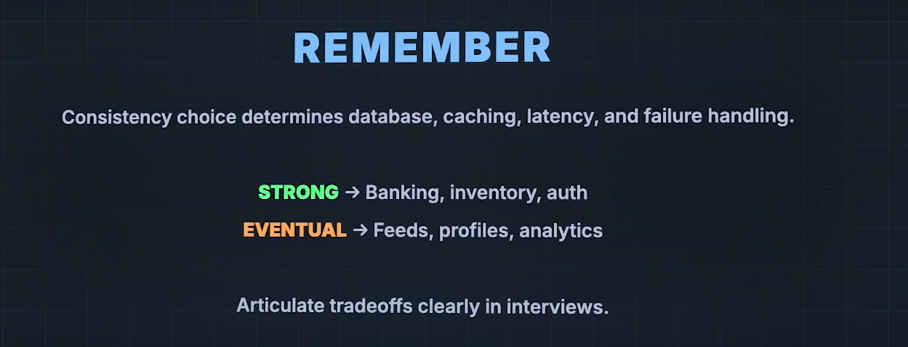
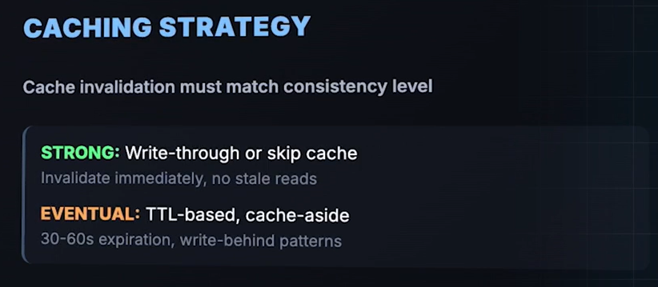
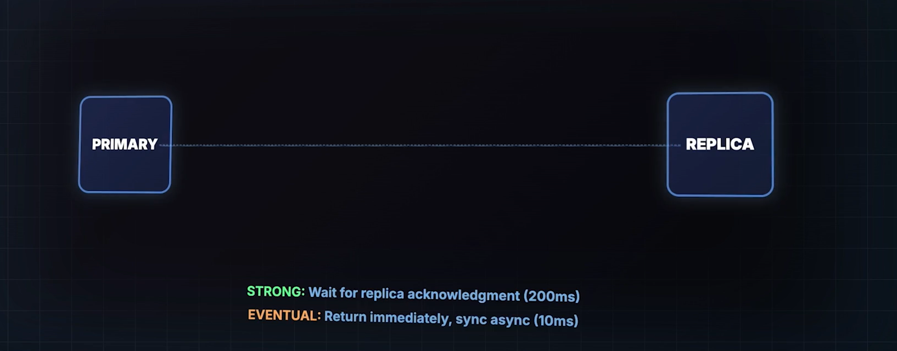

## 1)Database Selection
 
- For **STRONG CONSISTENCY** : Use PostgresSQL or MySQL with **Synchronous Repilcaton**, MOngoDB is used for majority Write concern!, BAsiucakly Single Leader Replication where writes are synchronous.
- <a href="../../../Terms and meanings/Module-3/SingleLeaderReplication/readme.md"><strong>Single Leader Replication</strong></a>:one node(Leader) is the only one allowed to handle writes, and one or more follower nodes replicate data from it.
- For **Eventual COnsistency**: DBs like DynamoDb and Cassabdra has Tunable COnsistency, which means we can make the DBs either Eventually consistent ot Stringly Consistent based on the needs
- We can use Multi-Leader or Leaderless replication
- Read Replicas with Async Replication

## 2) Caching Statergy:

## Strong Consistency
Use this when reads must always return the latest value.

### Recommended Strategies
- **Write-through cache**
  - Every write in DB should be updated in the cache.
  - Ensures cache is always in sync.
- **Skip cache for writes / read directly after write**
  - Avoids stale data completely.

### Key Behavior
- Immediate invalidation.
- No stale reads tolerated.
- Lower latency benefit compared to eventual strategies.
- Higher write latency (since cache + DB both update).

## Eventual Consistency
Use this when small staleness is acceptable in exchange for speed & availability.

### Recommended Strategies
- **TTL-based cache**
  - Each cached item expires after a set duration (commonly 30–60 seconds).
  - Eventually refreshes to latest value.
- **Cache-aside (Lazy loading)**
  - Read:
    - Check cache → if miss → fetch DB → store in cache.
  - Write:
    - Update DB
    - Invalidate cache or let TTL expire.
- **Optional write-behind**
  - Writes update cache first, database later.

### Key Behavior
- Allows temporary stale reads.
- Better performance & scalability.
- Simpler to manage in distributed systems.
---
## 3) Replication Statergy:

- Here is where we feel the Speed of Correctness Statrgy
### Strong COnsistencyb Flow:(latency: 200ms)
- 1) User write
- 2) Primary DB gets it
- 3) Primay waits till acknowledgement from Replica, only then it will return SUCCESS to user.

### Eventual COnsistenyc FLow:(latency: 10ms)
- 1) Suer writes
- 2) Primary gets it
- 3) Sends success back to the User and writes to itrs replicas eventually

# Drawback of Eventual Consistency:
- with eventual COnsistency, when 2 users update the value to same it causes a Conflict.
- **last Write Wins**: this COnflict can be resolved by accepting the value which was written at second/last, but the first user who updated, the value will be lost permanently , wont be in any records, thjis happens in **Cassandra and Dynamo DB**

## Vector Clock

## Conflict Free Replicated Data Types(CFRDT's):
- These are Special Data Structures which are mathematically designed to MERGE automatically without conflicts
- **Redis Supports this for Certai Data Structures like counters and sets**

## Application Level:

## <a href="../4.1) Intro To Cap Theorem/readme.md">Previous: Intro to CAP theorem</a>