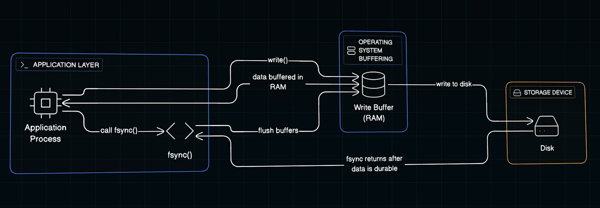
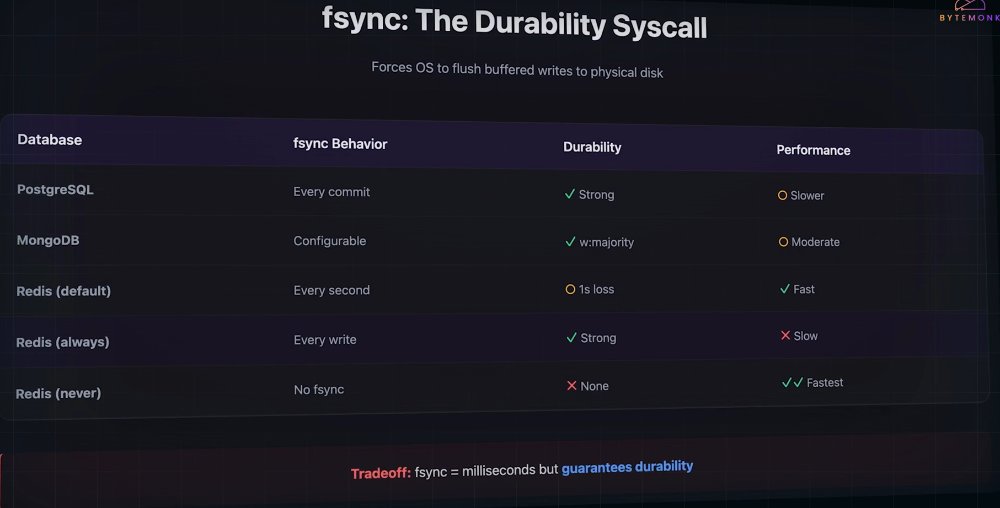

# Durability mecahnisms:
## 1) Write Ahead Log(WAL):
-  method for ensuring data integrity.
- before applying any changes to the main data store, the system writes the changes to an append-only log(which is Durable).
-  The log serves as a sequential, persistent record of **every operation**.
- If the system crashes midway through applying a change, the WAL can be replayed to restore the system to a consistent state.

### Stages:
#### 1) Log First:
- The system writes the change (e.g., “update row X with new value”) to the write-ahead log.
- This log entry is sequentially appended and written for durable storage, such as disks.
- That’s why the structure is called Write-Ahead Log, as we’re writing new entries ahead of others.

#### 2) Append Later:
- The system Updates the Data in Actual DAtaStructures, only after it was updated in the Write Ahead Log.
- This step can be asynchronous and may happen with some delay since the log already guarantees the change is not lost.

#### 3) Crash Recovery:
- If the System Crashes while Updating the actual DS but after the WAL entry, when the System Restarts, the Sb Server first runs through the Write Ahead Log, does the changes to the actual DataStructure so that no data loss is there.

## Fsync:

- Its a System Call which Provides Durability at OS level.
- generall when we store data it fist gets Stored in Write Buffer (RAM) of our Computers
- Fsync is  System Call which flushes all the memory in the  RAM into the Disk Memory of the computer
- But fsync is a time consuming operation, it takes few MILLISeconds to complete, in computing terms it costs eternity.
- Different DBs handles this differenlty:

## <a href="../readme.md"> Prev: Intro</a>
## <a href="../5.3) Durability Metrics/readme.md"> Next: Durability Metrics</a>