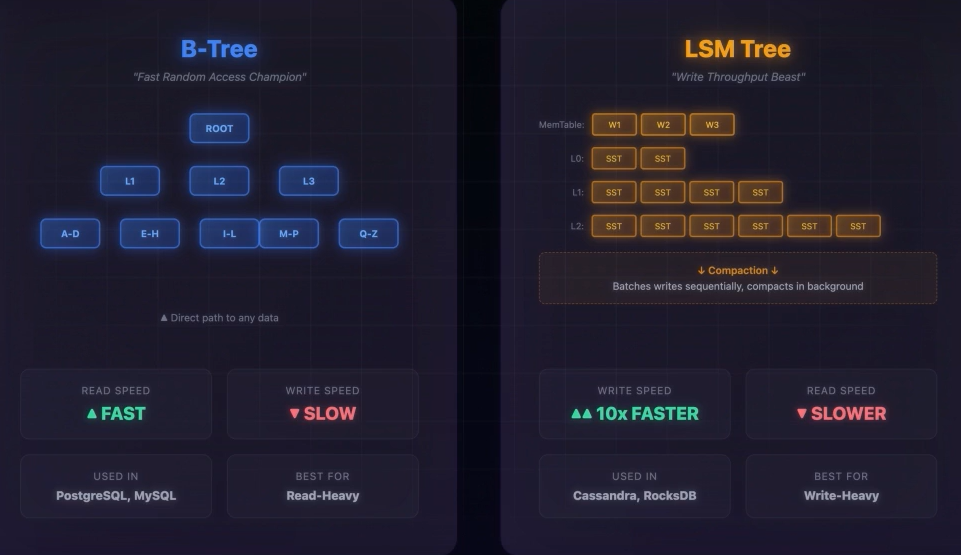
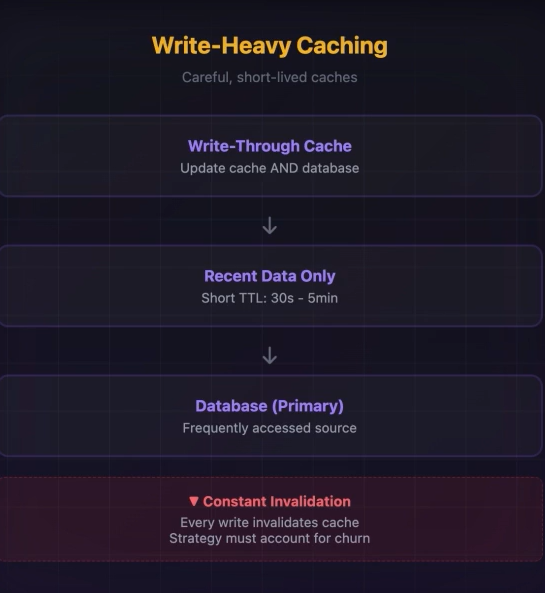

# B-tree vs LSM Tree
- Th echoice of B tree or LSM tree changes the Shape of the System's performance.
- If the System is Read heavy: Choose B-Tree based DB, which is SQL DBs. Example: MySQL, PostgreSQL
- If the System is Write Heavy: Choose LSM Tree based DB , which is NoSQL DBs . Example: Cassandra, Dynamo DB

## Read Heavy Caching:
- Read heavy systems are the most common systems.(Example: netflix, Social Media Feeds, Wikipedia, E-Commerce Feed Catalogue)
- The Read_write Ratio ranges from 90:10 , 95:5 and 99:1 
### Read Heavy Applications Require AGGRESSIVE CACHING:
#### 1) CDN Layer: To Cache Static Content
#### 2) Application Level Caching through Redis/Memcached
#### 3) DB Query Result Caching
#### 4) Every Cache Hit is a read which avoids a backend call, which reduces off the burden on the DB

### Read Replicas:
- Reduce the calls to Primary DB by creating Read Replicas
- Create Read Replicas across multiple Instances

### Implement Eventual Consistency
- Trade Strict Data Consistency over massive Performance

### Denormalization:
- We often Duplicate the Query Responses to avoid Expensive JOINS

### Fan-Out on Write
- Pre-Compute Results while Writing
- pay the cost on write to create blazing fast read Heavy Systems.

## Wite Heavy Systems:

- Use LSM Tree based Trees fo r Write heavy systems
- Use NoSQL dbs like Xasssandra and RocksDB
- 10x faster than B-trees

## Statergies:
### 1) BAtching and Buffering:
- Instead of writing every Requests, we Buffer them and Write them as Single Request, this Amortizes the Cost across many operations     
- write ahead logs or commit logs like Kafka Excel here.
