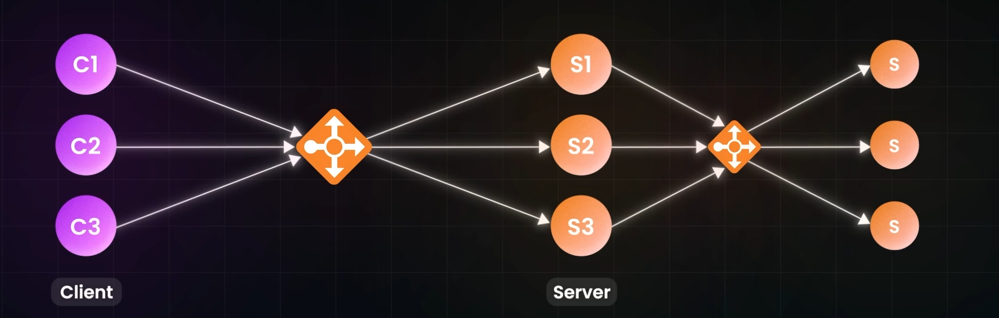
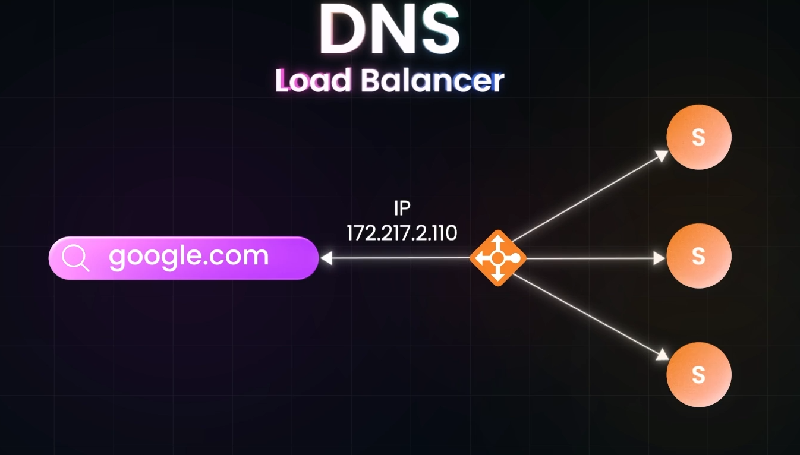

# Load balancers:
- It's job is to redirect the CLientr Requests to servers such that it increases Throughput and Decreases Latency.
- Vertical Scaling is Expensive and hits a roof quickly, so Horizontal Scaling is preferred over Vertical Scaling.
- In Horizontal Scaling, If client communicates with the Server Directly there is chance that one of the Server is Overloaded with Traffic and Other is free of Traffic/Lesser Traffic
- This problem is SOlved by Introducing Load Balancer.
- It Directs the Traffic to the Server such that the workload for the server is balanced.
- Load Balancers Hides the the Servers from the Clients, so it can also be called as `Reverse Proxy`

## Load Balancers are not limiited between only Client and Server
- It can be placed between the Servers and the DB.
- Or betweeen server and Server. 

- Present in DNS layer of the website 

- Google has Many Servers which return the IP adress of the typed domain name, in Load Balanced way.

## Types of Load balancers:
### 1) hardware Loadbalancers:
- Limitte Customizable
- Expensive
### 2) Software Lpadbaalncers:
- Highly Customizable
- Cheaper(Cost Effective)

## Server Selction Statergy:
1) Random
2) Round Robin(Most Popular)
3) Weighted Round Robin (Done when one Server is more powerful than other)
4) Server Traffic:
    - It Pings the Server
    - gets the knwo about the health of the Server, by getting to know about its CPU utiilzation, storage, How fast the server is Responding, It decides to Direct Traffic or not.
5) IP Hashing (IP Based): useful when server is caching, reduces cache Miss