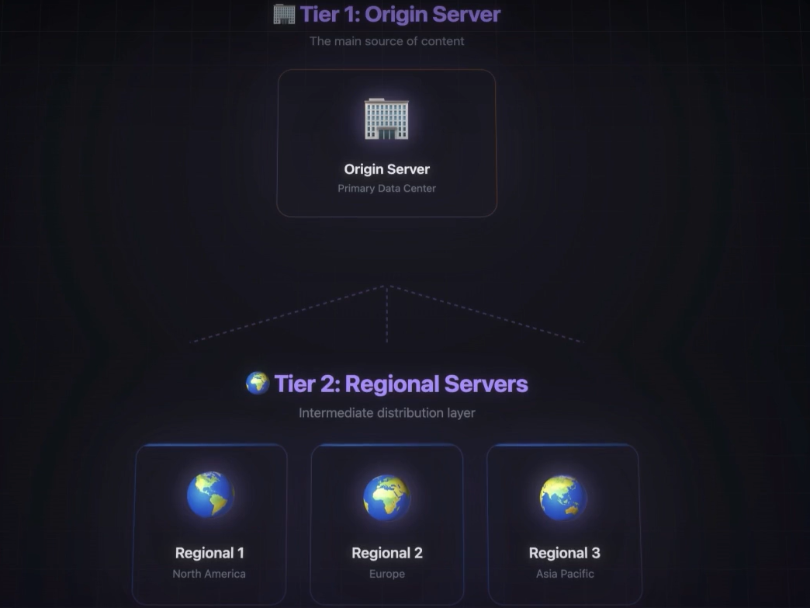
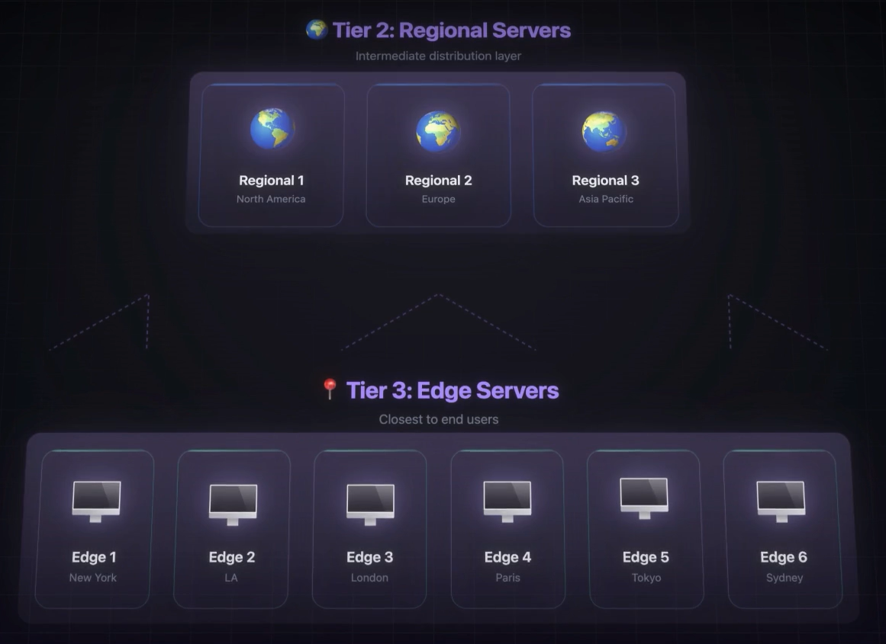

# Content Delivery Network:
- It's a system of service Located spreaded among Different parts of the World, which works to provide content more faster and thus providing a better user Experience, by sending the contents faster even when the Main Servers are located far away from the User.
- Example: A person in NYC wants to Access a website Hosted in London, They get the contents of the Website from the CDN server located in NY, which is much closer than London, now the user just needs to connect to the Serve in NY rather than in London

## Importance of CDN:
1) Fast Content Delivery
2) Reduces Load of the Main Servers. Thu ensuring high Availability
3) It protects by giving Protection against Distributed Denial Of Service Attacks. This is done by Distributing the attacks/reqs to multiple servers, CDNs can ABSORB and Distribute the Malicious Traffic attacks to the Origin Server.
- There are three tiers:
   
   
   - - Source server
      - - Main Source of Data/Content for the CDN
      - - Responsible for generating and Storing the Original Version of the content
   - - Regional Servers ( Region wise server, exaplmole Asia server,Europe sever)
      - These Servers are Connected to the Source Server/Origin Server
   - - Edge Servers (New York server, London server, etc)
      - Edge Servers at the Bottom of the Heirarchy, connected to Tier of Regional Servers
  
