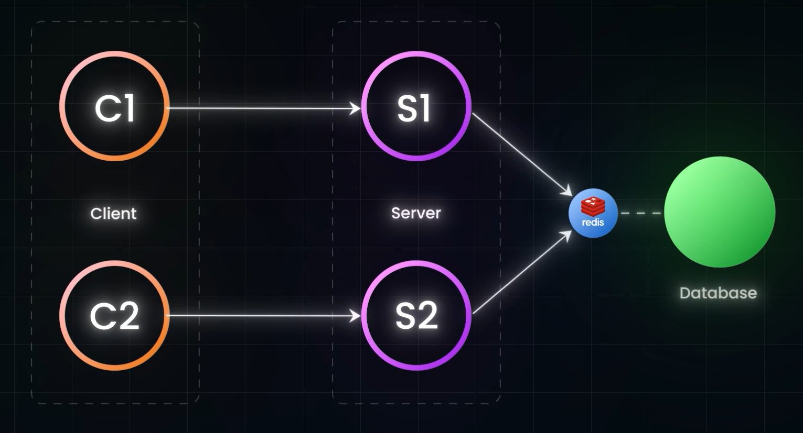

## Example of Caching in Youtube:
- If each server has its own Cache for Comments of Video, then it mayu end up in disp;aying Stale comments or outdated comments
- Which is inturn result in bad user expreience, and some one might reply fpor the comment which doesnt even exist!
- So instead of Each server having its own Cache, there shd be a common or shared Cache for all the servers
- That is there should be IN memeory DBslike Redius or memcached betweent the Server and Database 

- This results in having Single Source of Truth in Cachign Mechanism.

#### Exceptions:
- Some infos like YT video total number of views, these things need not to be accurate
- SO IN TERMS OF INTERVIEW, WE SHOULD ASK THE INTERVIEWER WHETHER THEY CARE ABOUT ACCURACY OF THE DATA MUCH!
- For these cases, we can use NAIVE caching statergies like as we did before, caching in-server.

### NOTE:
- Caching is POWERFUL when the data is static
- Chooose caching when there is SINGLE ENTITY reading and Writing Data
- IF you dun care much about Consistency for Data please chooose caching!