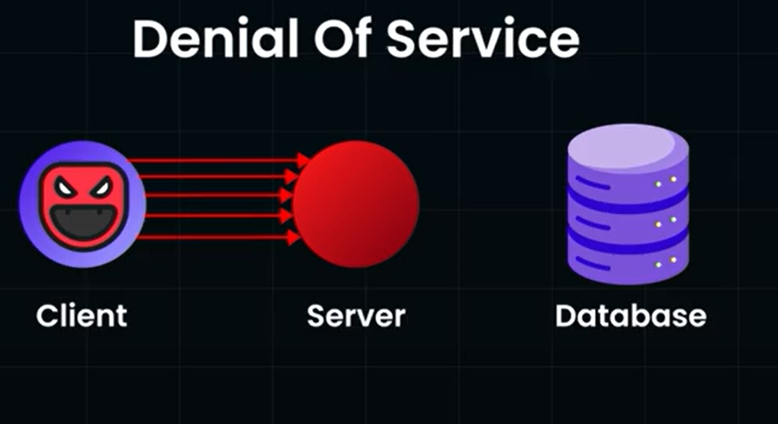

# Rate Limitting:
- It is done to block request from the IP address if too many request came from the IP address within short span of time.
- Amount of operations that can be Performed within a given amount of time
- Its a very important Statergy in Large Distributed systems
- If its not in action , a server could be taken down through DOS byu malicious Clients.  

- Doing Rate Limitting can protect the Server from Going Down.
- Advanced Version of DOS: DDOS(Distributed Denial Of Service)
    - In this, Multiple Systems/,machines, flood out system/server with traffic from various direction/locations.
    - It's hard to Rate Limit as its comes along with the Normal Server Traffic, its hard to recognize if the Req is from the MAlicious machien or from normal traffic

## User based Rate limitting:
- 

## Server based Rate Limitting:
- SUppose we are building websie o targte only audeince from US
- So we implement Ratee limitting to all other counttires exept US, therefore reaching out ,ainly only to Customers in 