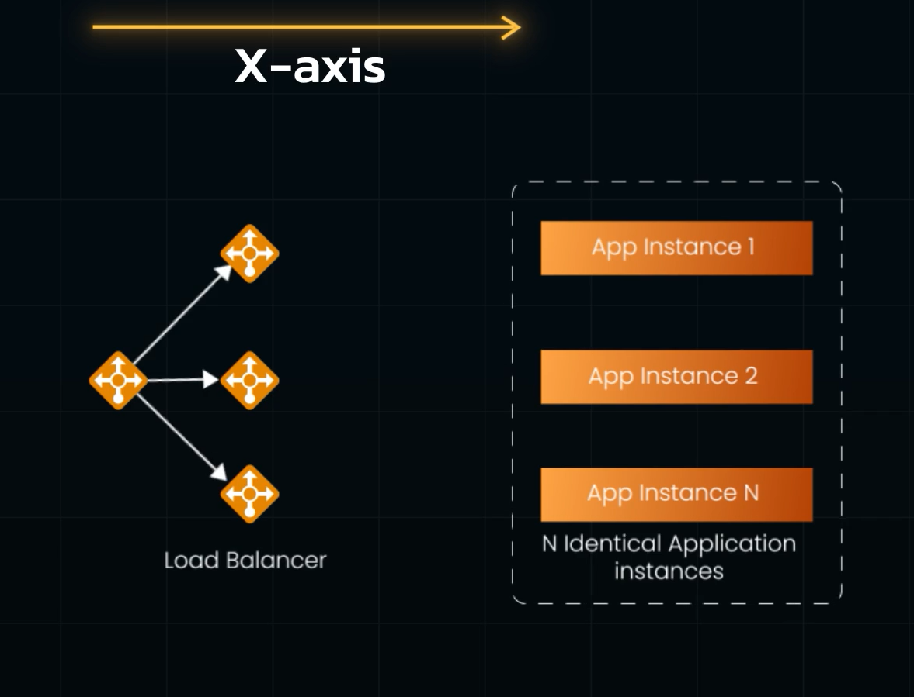
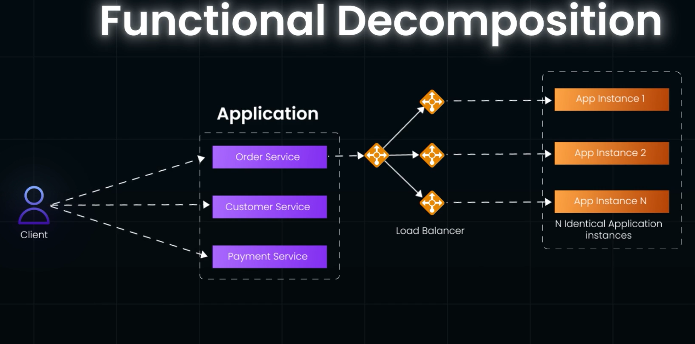

# Scale Cube:
- It provides a way to think about Scaling an Application in 3 Dimensions, i.e X axis, Y axis and Z axis.
## X- axis Scale(Hosrizontal Scaling Approach):
- Involves adding more Instances
- Most Common way to scale a Monolithic System. 
 
- INvolves Runnign Multiple Identical Applications behid a LoadBalancer.

## Z-axis Scaling

## Y-axis Scaling(Functional Decomposition):
     
- Dividing the Whole Application into `smaller Independent Services`,where each Service is responsible for a particular function/service
- THese Services are in turn scaled  independently using X-axis scaling or Z axis Scaling
- Advantage: Each service can be developed and deployed INDEPENDENTLY
- microservices are Higher Level Definition of Y-axis scaling