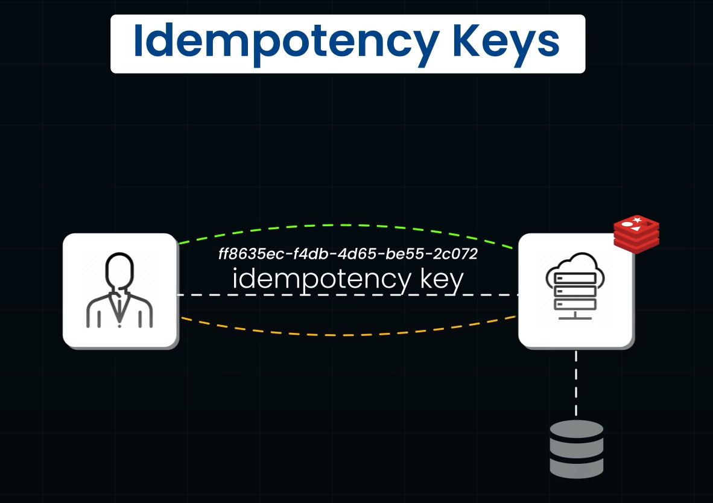

# Idempotency:
## in simple terms:
- The First request Creates a result/outcome
- The subsequent Requests creates the same result or Outcome

## How paypal uses idempotency to make transactions safe
- When we click PAY button, the payment Gateway creates an Idempotency Key for that particular transaction, this ensures that the payment/transaction happens only once, even whent the user clicks PAY button multiple times
- If same Key is submitted multiple times, the Gateway recognizes the keys and processes the payment only once, preventing accidetn double/triple payments
### Idempotency Keys:
- These are `Unique Identifiers for operations`
- They can be UUIDs, Random strings or any value which can distinguish from one another.
- best PRactice is to use UUIDs
 

- If client Sends Req with teh Idempotency Key, the system stores the result along with the Idempotency key in perisitent storage, so when a transaction occurs with same Idempotency key it can ignore.