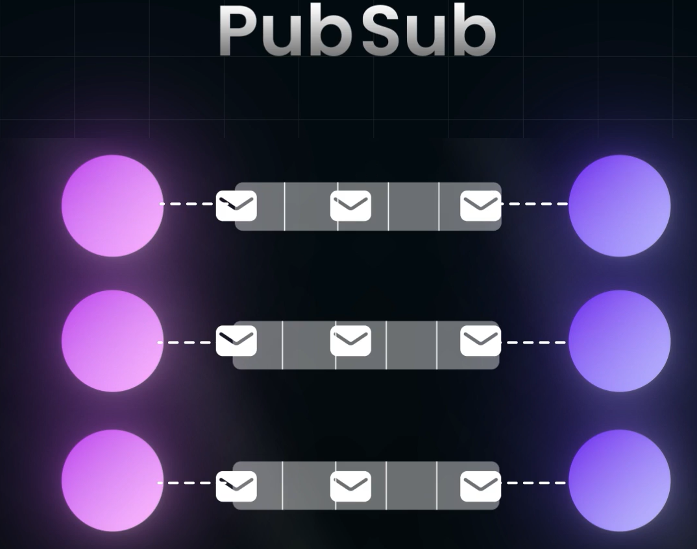

# Pub Sub

- Publish/Subscribe (Pub/Sub) architecture is a messaging pattern where senders (publishers) do not send messages directly to specific receivers (subscribers).
- Instead, messages are published to a channel (topic), and subscribers receive only the messages they are interested in, based on the topics they subscribe to.
- This decouples the senders from the receivers, allowing for a more scalable and flexible communication system.
- The topic(channel) is a peristent storage, which canbe in-memory DB like redis/memcached

## Most Common Pub-Sub Tool:
- Apache Kafka

## Why Pub Sub
- When thinking about designing a Distributed System , we need to think about Perisitent Storage
- Persistent Storage doesnt only mean Database
- We may also wanna store some form of asynchronous operations
- Data about Asynchronous Operations are not stored in Databases
- This is where Pub Sub Model Comes into play
- Servers are Publishers
- Clients are Subscribers
- Subscribers listen to teh Publishers by Subscribing to their Channel (topic)
- Client can Subscribe to more than one publisher(Topic is Intermediatary between Publisher and Siubscriber, there is an intermediate medium, instead of Client and the Server having a straight one to one connection)
- `It delivers the message to the client in which it is posted by the Publisher to the channel, so the channel is actually a Queue, this si possible due to the nature of Persistent Storage`

 

- Message can be a `data block` or an `Operation`
- **This Pub Sub model guarantees The messages that comes inside the channel, will be delivered to the clients atleast once**
- In the channel, the channel stores the subscribers in terms of Subscriber ID, so when a message is sent to the client and the client ACKNOWLEDGES that it got the message, then, it notes that message has been delivered to the Subscriber ID. This tracked Data can be cleared from teh topic when all the subscribers have acknowledged!

## Important Point:
- `use Pub-Sub architecture only for the Operations which is Idempotent`, because, the Message maybe delivered more than once BY the Channel more than once.
- In this architecture, messages might be delivered more than once, which results in problem if the functionality or the operation is Idempotent
- Due to the Persistent Nature of the Topic/Channel, we can also implement functionalities like Resending the message