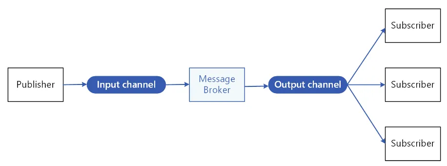

# Pub Sub

- Publish/Subscribe (Pub/Sub) architecture is a messaging pattern where senders (publishers) do not send messages directly to specific receivers (subscribers).
- Instead, messages are published to a channel (topic), and subscribers receive only the messages they are interested in, based on the topics they subscribe to.
- This decouples the senders from the receivers, allowing for a more scalable and flexible communication system.