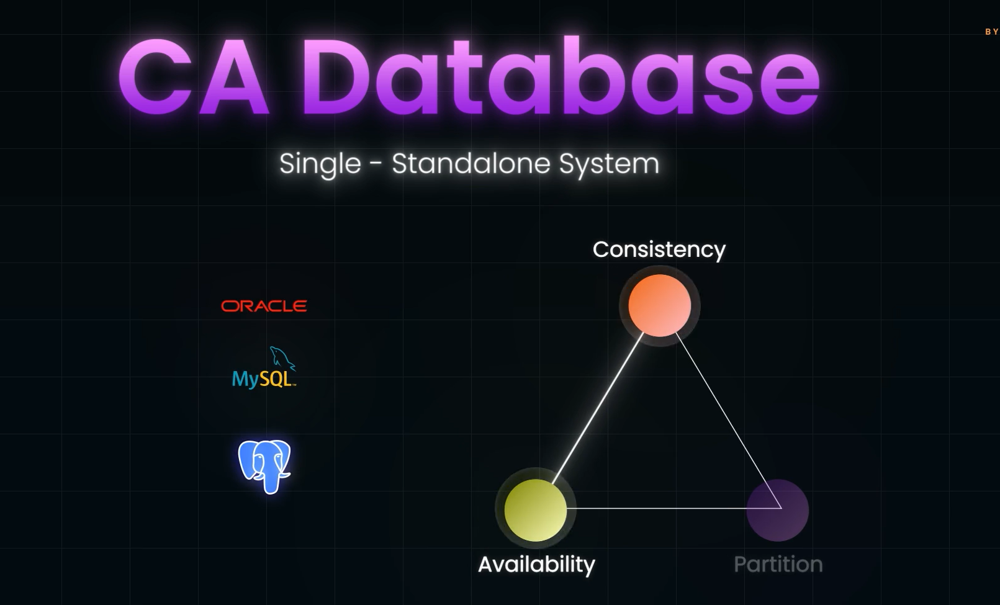

- No SQL DBs are OFTEN Chosed for Distributed System Architecture, **as it is Horizontally Scalable**
- In contrast SQL DBs are vertically Scalable, making the system rely on Powerful Machines

## CA Databases(Consistency and Availability):

- These DBs are Standalone DBs therefore , no need to care about Network Partitioning!
- Example: MySQL, ORACLE

#### But in real life, that is in Systems with Distributed Architecture, NEtwork Partitioning is inevitable
    - Therefoer DBs are divided into:
    1) Consistency-Partition DBs(CP)
    2) Availabilityu-Partiton DBs
## CP DBs:
- DB node Wait for a RESPONSE from the partition's node, in order to maintain consistency among all the nodes of the DB, even if the waiting time leads to a time-out.
- Chooses CONSISTENCY over AVAILABILITY
- Online Bankng System and Airline Reservation System

## AP Dbs:
- Chooses Availability over Consistency
- Chooses **EVENTUAL CONSISTENCY* over **STRONG CONSISTENCY**.
- Can lead to Stale Data.
- Choose this DB when you want your application to be Responsive even when it costs displaying of stale data.
- Shopping cart in Amazon, even if the cart is not Synced between ALL systems in whcih the user has logged in, they want smooth interaction of the user with the application