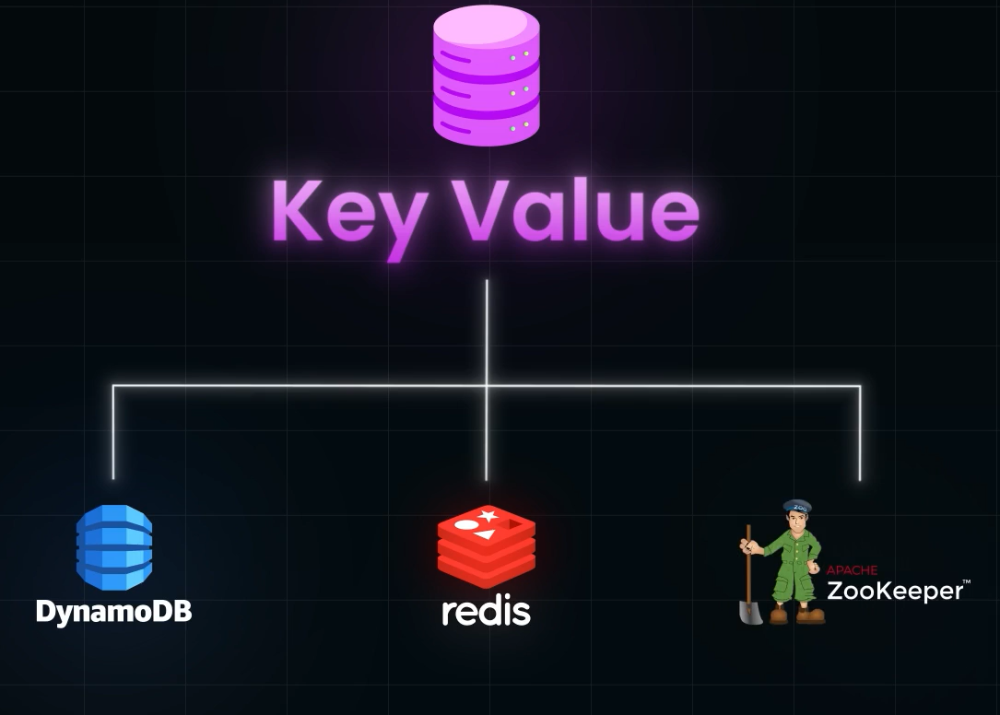
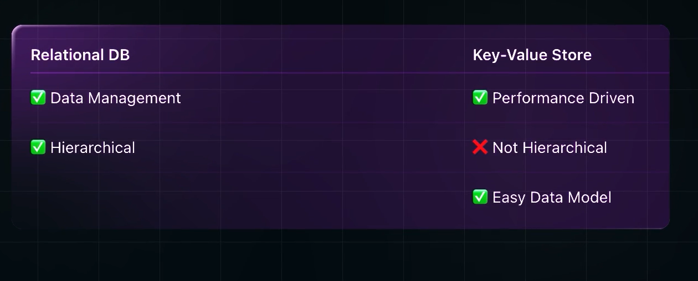

- NoSQL Databases are Key Value Store Databases
- Key-Value Store is the Most Primary and Simplest Version of all Databases
- **PErfect Use case of Key-Value store is Caching**
- Redis  is a Popular Database to implement Caching

### NOTE:
- Since we are Searching through Keys, we dont need to search each row of the Database to get the value.
- We can just Directly access them with Keys, which makes them EXTREMELY Fast, resulting in Low Latency and High Throughput
- Key Value store Doesnt neeed QUERYING LANGUAGE as it is in RDBMS DBs
- Operations Valid in Key-Value Storages: GET, PUT, DELETE

### Examples:

- Dynamo DB Writes Data to DISK, therefore Data Persists Power off of the system
- Redis writes data to Memory or RAM, therefore its Volatile, which is more faster to retrieve

## RDBMS vs Key Value DBs:

- When Data Management is moree important than performance, choose RDBMS, but if youn prefer performance, choose Key Value pair DBs as they provide much greater performance than RDBMS
- When the Data is Heirarchical RDBMS, If the data can be Modelled in less compilcared way, go with Key-Value pair databases, as it will end up having much better performance than RDBMS