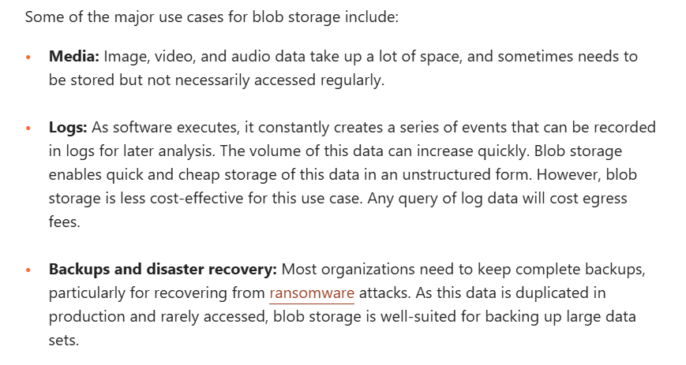

## BLOB Storage: (Binary Large Object Storage)
- Blob storage is a type of cloud storage for unstructured data, ITs a type of OBJECT storage
- Blob storage is particularly useful for storing media, large file backups, and data logs. 
- They are a series of bytes, with each byte made up of 8 bits (a 1 or a 0, hence the "binary" descriptor). Any type of data can go in a blob.
- Binary Large Object, is a mass of data in binary form that does not necessarily conform to any file format
- Blob storage keeps these masses of data in non-hierarchical storage areas called data lakes.
- Blob storage is just used when the organisation wants to Reduce time in while performing the action of storing the data. 
- Its just like Dumping all clothes in one area, in unorganised way. But the Time for Searching and locate Specific Data will be time consuming
- Used by Organization which need to store large volumes of it without organizing it into a hierarchy or fitting it into a given format.

## Use cases of Blob:
