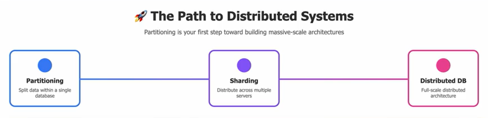
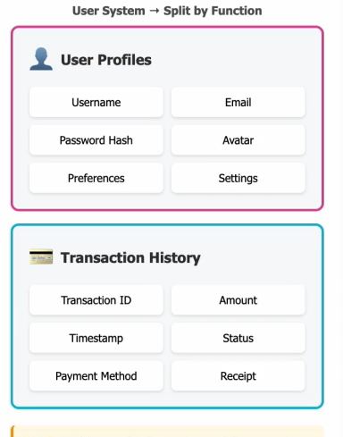
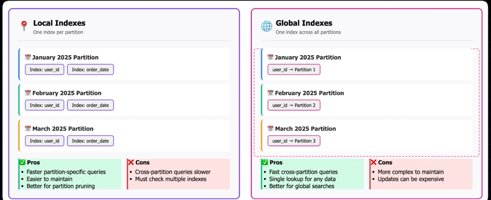
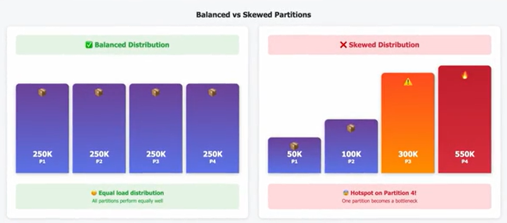
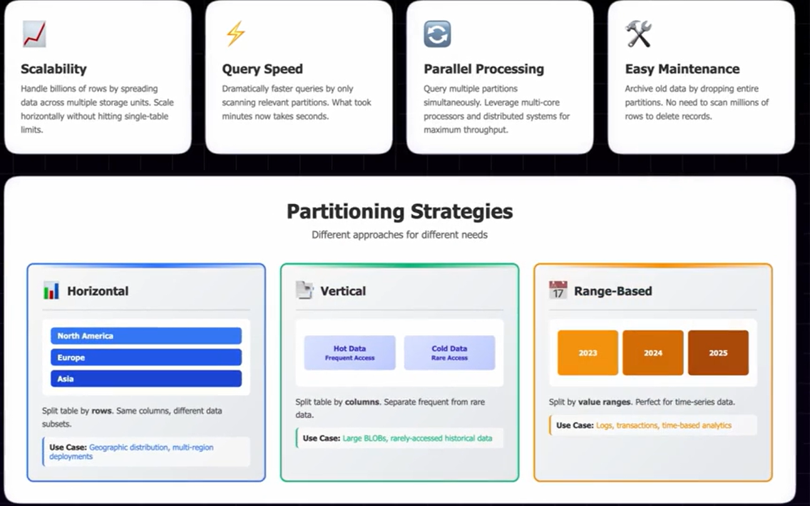

# Partitioning: 
 
- Dividing Data, in a SINGLE DB  or a system into LOGICAL SECTIONS
- Stores data in ORganized way
- Ensures scalability.
- if the data is Unorganised and the data is just dumped in DB randomly then Time required to search a particular value will become costly and When the Size of data stored is enormous, The Time complexity to search or delete values will become Incredibly slow and expensive

## Partitioning Enables PArallelism:
- As the data is partitioned, for example if we want to search a value/data in the DB, the Server can  simultaneously search for the value in both the dbs
- Maintenance becomes more easier with partitioning of data

# Types of DB Partitioning:
## Horizontal Partitioning
- It partitions the table by ROWS, For example, theer si a column called COuntry, the Table can be Partitioned like, All rows with CountryIndia will go into one Partition, US goes into another partition
- Common when you want to Divide Data across Multiple Servers or Storage units

## Vertical Partitioning:
- Divides Table by Columns
- With this, you can partition, more Frequently USed Columns in one partition and other Columns in Another pArtition

## Functional Partitioning:
- Divides Table based on Business Function or purpose.
- For example we can partition USer System Table into User Profile Partition and Transaction History Partition.
- COmmon in Microservices Architecture. 

## Local Indexing VS Global Indexing: 

## Range Based Partitioning:
### Partition Pruning
- A method used for Efficient access of Time Bound Data with Minimal IO

## Partitions make LifeCycle of Data in the DB easier:
- Partitions are not static
- It evolves as Data size increases
- PArtitons can be created Periodically (example: Range based partitioning).
- therefore some of the partitions may get old, these old partitions can be archived

# Sharding:
- Implementing Partitioning in Distributed System.
- **Distributing** Partitions across multiple seperate DB servers or Nodes.

## Cons of Partitioning:

### 1) If query needs to collect Data from MULTIPLE PARTITIONS
- IO operations becomes potentially slower when compared to query hitting single partiton.

### 2) Maintaining global Indexes may become tricky and expensive
- Everytime a new partition is created teh Global index , needs to be updated across all partitions, this adds overhead.

### 3) UNEVEN Distribution (partiton skew)
- IF we are not careful in Data Partition, we might end up having large amount of data in one partition than other, which defeats the whole purpose of PArtitioning  

## Summary:  

