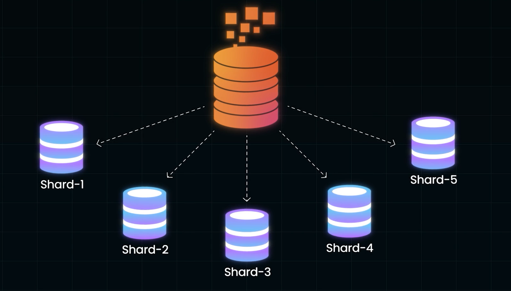
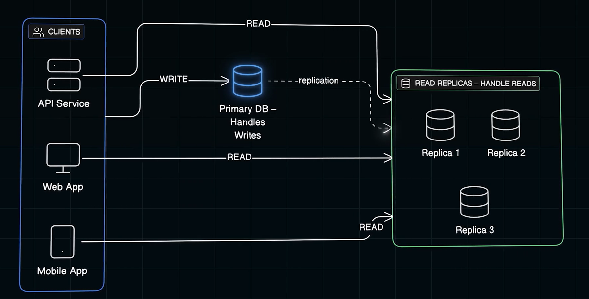
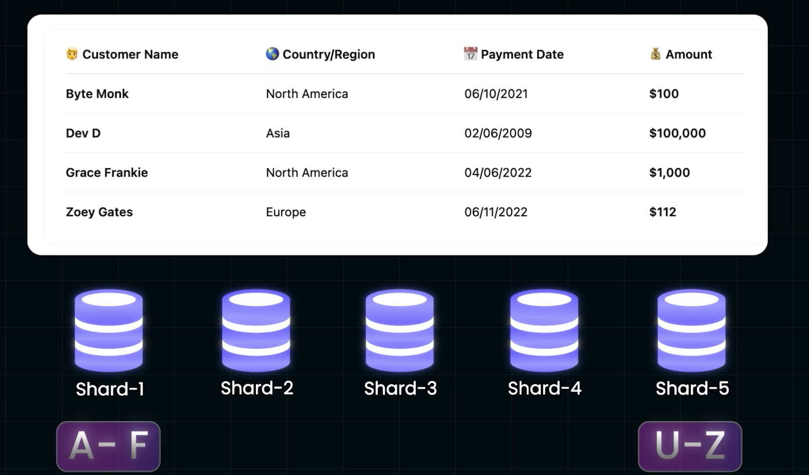
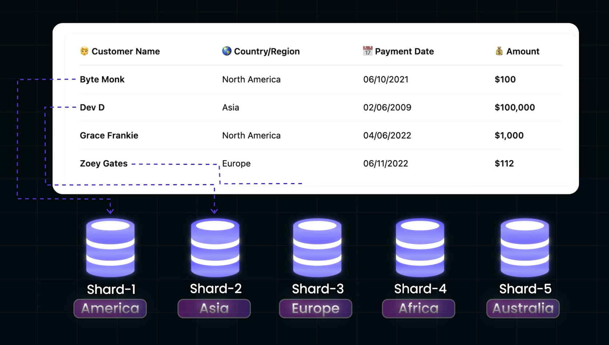
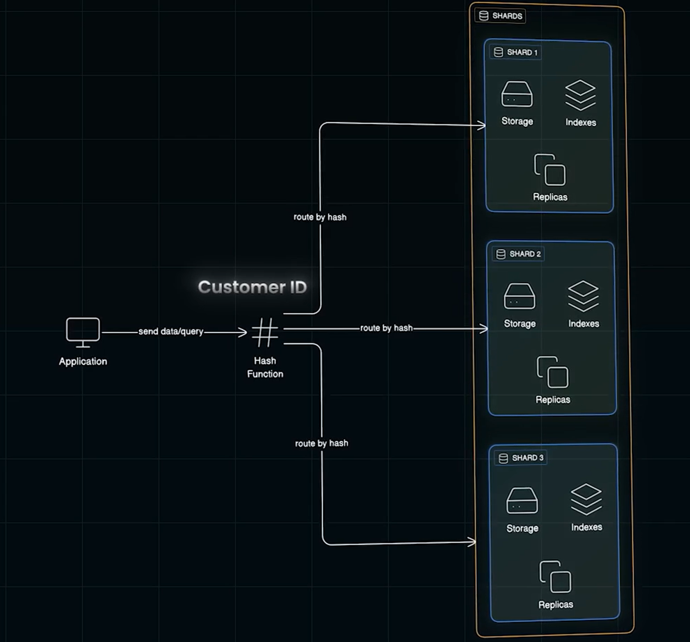
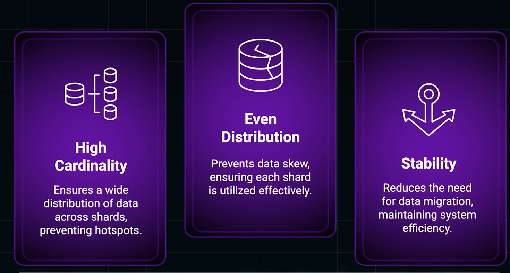
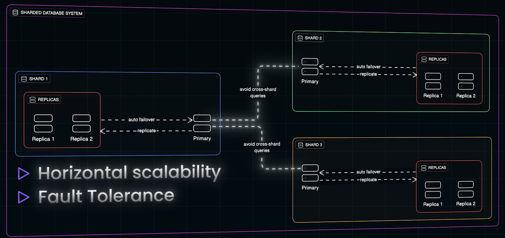
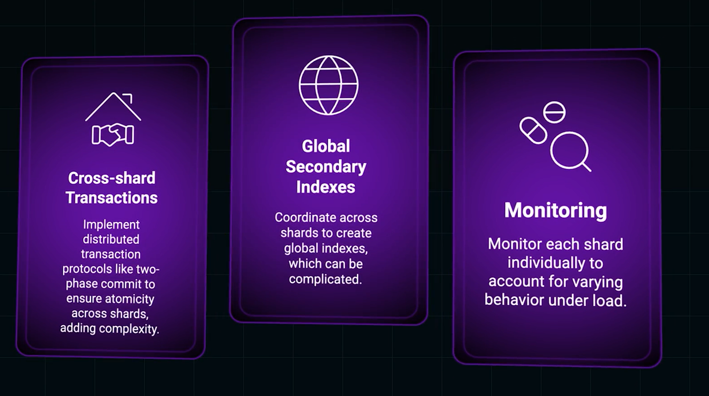
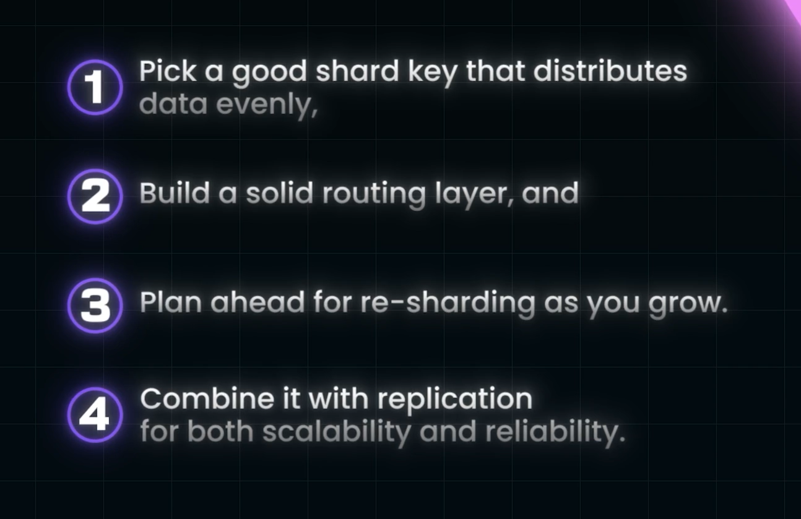

# Sharding:

- Partitioning the main DB into multiple DBs is called Sharding and the Database is called Shard
- Each Shard is ran in a DB server, thus enabling parallel Querying, Improving performance

## Vertical Scaling:
- Done by Increasing the RAM, Data Storage in one DB.
- Hits a ceiling soon, cant upgrade more due to Exponential cost or Plateue in Infrastructure
### Having Replicas to improve Read Throughput: 
 
-  Read throughput can be increased by replicating the DB, but WRITING needs to be done only by the Primary DB. 
- this doesnot reduce the WRITING load by the Primary DB
#### So to truly scale with READ and WRITE Throughputs, we need to Implement Horizontal Scaling i.e SHARDING

# Sharding of Table or DB can be Done by:
## Based on Starting letter fo the Customer Name:
 
## Based on Starting letter fo the Region/Country:

### Data Hotspots:
- But our choise of  method of sharding should be done carefully as, it may load one of the DB Server with Huge Traffic while others with less Traffic, causing **Data hostspots**
- This can be overcame by using Hash Function to distribute data between the DBs
## Hash Function:
- This function hashes the username or other paramater and distributes the Datas evenly among the DB servers. 

### Shard Key
- The HAsh function has **Hash Key**, through which it gets to know which DB server to Contact for certain Query.
- Its an attribute which determines where Each piece of Data lives
- Choosing the shard key will be one of the most critical decisions in the process of Sharding

### Properties of  Shard Key:

## Shard:
- Each Shard has its own **Storage, Replicas and Indexes**

## Cons of Sharding:
  

## Best Pracitices to Implement Sharding:
