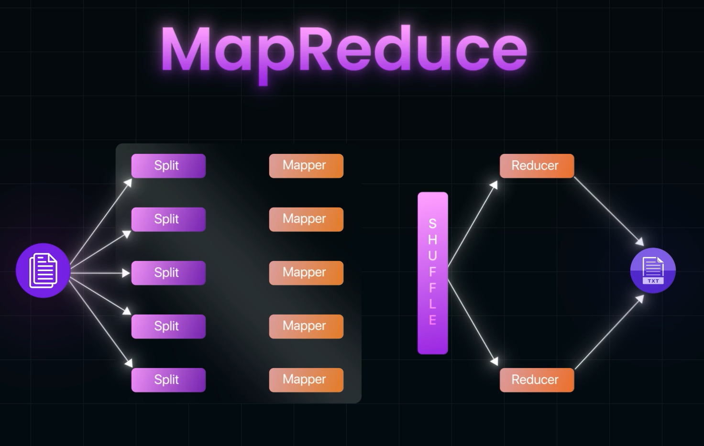
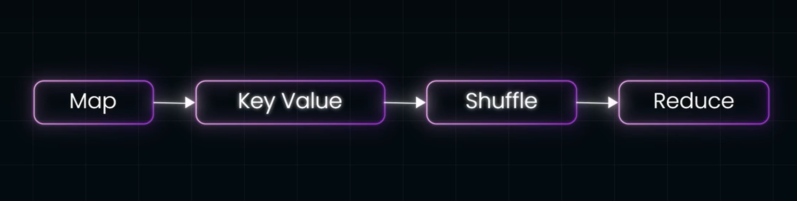
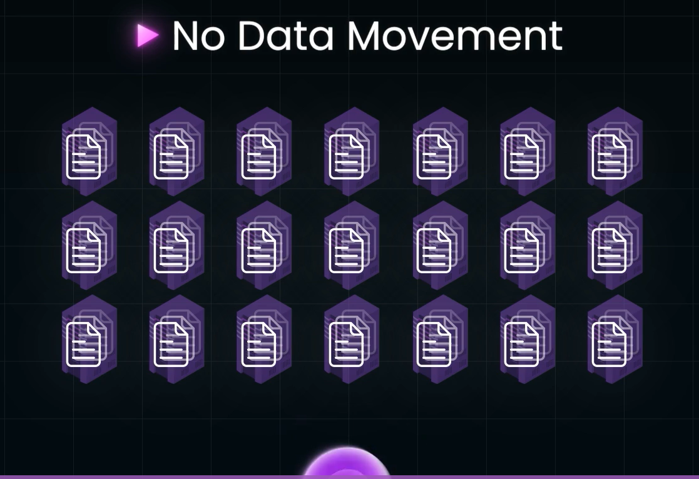
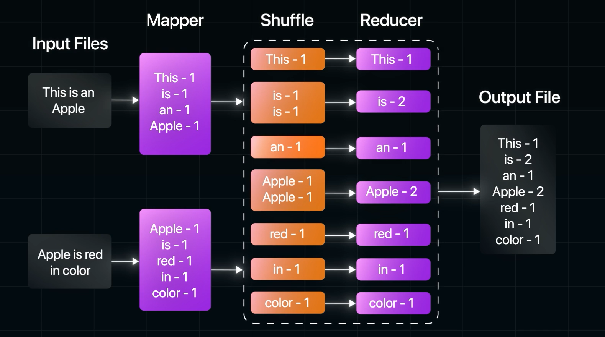

# Map and Reduce:

- Map task deals with splitting and mapping of Data
- Reduce task deals with Shuffling and reducing the Data.
- Map task converts data into KEY VALUE PAIRS.
- now this key value pair resides in this intermediatary step, of Map Reduce Java Process
- THese key value pairs are shuffled around and re-organised that makes sense in the final output
 
- Intially Used for Data Processing at LARGE SCALE, in Distributed Systems architecture, in order to make the Data  Analysis more efficient. 

## COnditions to implement MapReduce Technique
- Distributed File System, headed by a Central controller, which is aware of everything goin on about MapReduce Job
        - The central control is able to control 
- No Data Movement 
     
        - Since we are dealing with LARGE Datasets, we ust let them live in their respecitve machines
        - Therefore We Operate the MapReduce function on the Data locally on the respective machines
    
- Key value Structure of Data in the Intermediatary step:
    - All the datasets in each local machine are just part of one Large Dataset
    - Therefore there can be many common things between datasets in Different machines
    - Therefore assigning Keys to the values must be done with care, as if different keys are given to same value or data, it can cause Chaos
    - its also easier to reduce to One single value followed by other machines too
- How to model/architecture handles Network Failures(Idempotency is a Requiremnt):
    - TO handle failures, the Database server/machine redos the mapReduce function to the dataset
    - If there was failure in converting data to key value pairs and the intermediatary stage, the Central Controller will re-perform the Operation then moves on with REDUCE Step, this is possible onlhy when map and reduce function is Idempotent

## Library to use to Implement MapReduce:
- Hadoop
## How MapRediuce fuction internally (Illustated with small example):
