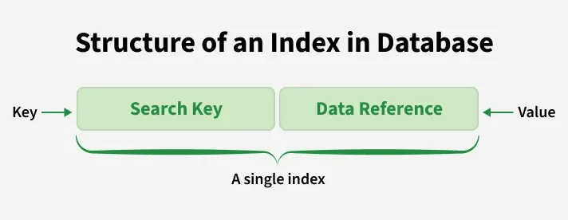

# Indexing in DBMS:
- Indexing in DBMS is used to speed up data retrieval by minimizing disk scans. Instead of searching through all rows, the DBMS uses index structures to locate data using key values quickly.

